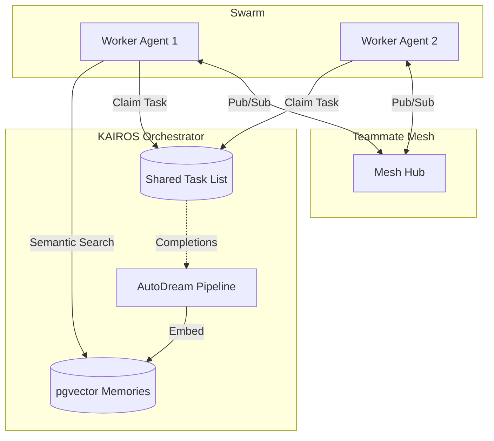

# KAIROS Orchestration: Unified Architecture (Phase 4)

## Architecture Outline
The OHC Swarm requires a durable database schema and microservices mapping to decompose high-level feature requests for the agent team, along with deep-deliberation cycles, a distributed state machine, background queuing logic, and a highly available realtime communication layer.

## KAIROS Triad
1. Shared Task List: PostgreSQL distributed state machine.
2. Teammate Mesh: Highly available low-latency communication layer using Redis.
3. AutoDream: Minimax LLMs compress session logs and embed into pgvector index.

## Styling requirements
Any downstream UI interpreting this architecture MUST apply:
backdrop-filter: blur(20px) saturate(200%);
background: rgba(255, 255, 255, 0.03);
font-family: 'Outfit', 'Inter', sans-serif;
border-radius: 12px;
border: 1px solid rgba(255, 255, 255, 0.1);
