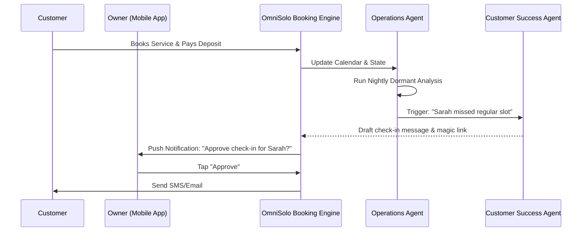
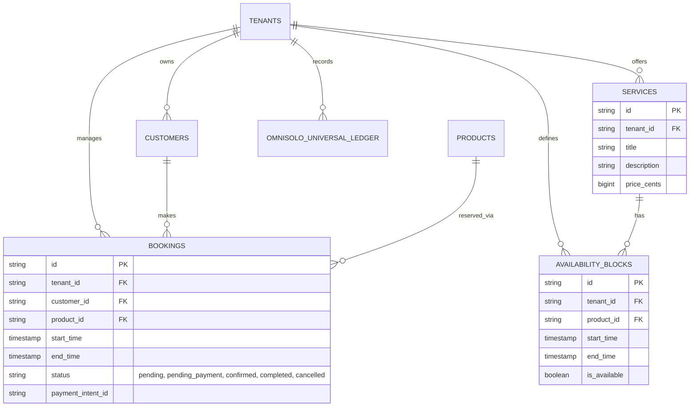

# OmniSolo Autonomous Unified Booking & Revenue Engine

## 1. Sequence Diagram

```mermaid
sequenceDiagram
    participant Customer
    participant OwnerApp as Owner (Mobile App)
    participant OmniSolo as OmniSolo Booking Engine
    participant OpsAgent as Operations Agent
    participant CSAgent as Customer Success Agent

    Customer->>OmniSolo: Books Service & Pays Deposit
    OmniSolo->>OpsAgent: Update Calendar & State
    OpsAgent->>OpsAgent: Run Nightly Dormant Analysis
    OpsAgent->>CSAgent: Trigger: "Sarah missed regular slot"
    CSAgent-->>OmniSolo: Draft check-in message & magic link
    OmniSolo->>OwnerApp: Push Notification: "Approve check-in for Sarah?"
    OwnerApp->>OmniSolo: Tap "Approve"
    OmniSolo->>Customer: Send SMS/Email
```

## 2. Entity-Relationship (ER) Diagram

```mermaid
erDiagram
    TENANTS ||--o{ CUSTOMERS : "owns"
    TENANTS ||--o{ SERVICES : "offers"
    TENANTS ||--o{ AVAILABILITY_BLOCKS : "defines"
    TENANTS ||--o{ BOOKINGS : "manages"
    TENANTS ||--o{ OMNISOLO_UNIVERSAL_LEDGER : "records"

    CUSTOMERS ||--o{ BOOKINGS : "makes"
    SERVICES ||--o{ AVAILABILITY_BLOCKS : "has"
    PRODUCTS ||--o{ BOOKINGS : "reserved_via"

    BOOKINGS {
        string id PK
        string tenant_id FK
        string customer_id FK
        string product_id FK
        timestamp start_time
        timestamp end_time
        string status "pending, pending_payment, confirmed, completed, cancelled"
        string payment_intent_id
    }

    SERVICES {
        string id PK
        string tenant_id FK
        string title
        string description
        bigint price_cents
    }

    AVAILABILITY_BLOCKS {
        string id PK
        string tenant_id FK
        string product_id FK
        timestamp start_time
        timestamp end_time
        boolean is_available
    }
```
