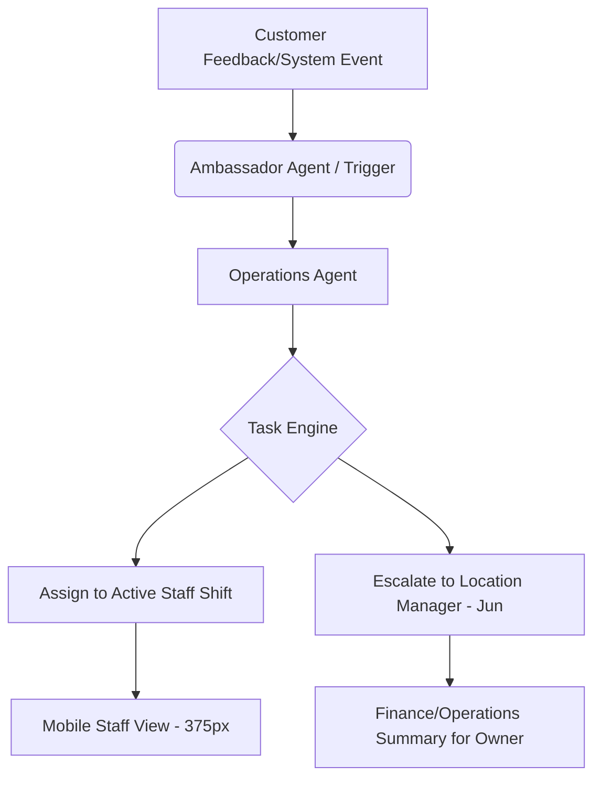

# Mission Queue Protocol: Agentic Staff Coordination & Issue Escalation Engine

## 1. Problem Statement
Location managers like Jun (31) run the day-to-day operations for one site. They need to coordinate staff tasks, manage local customer feedback, handle supply reminders, and summarize escalations for the regional owner. Currently, OHC lacks a unified staff operations system, forcing managers to rely on fragmented tools (WhatsApp for staff, spreadsheets for inventory, paper checklists for tasks) which are disconnected from the primary OHC agentic workflows.

## 2. Research Report
- **Market Context**: Platforms like 7shifts, Homebase, and Sling specialize in staff scheduling and task management but are disconnected from the core business storefront, CRM, and POS. Enterprise tools like Workday are too complex for micro-SMEs. We need an integrated, agent-guided experience.
- **The OHC Opportunity**: Integrating staff task management with the Operations Agent allows autonomous task creation. For instance, if a customer complains about cleanliness via the Ambassador Agent, the Operations Agent automatically assigns a "Clean Lobby" task to the active shift without managerial intervention.
- **Competitor Gaps**: Traditional platforms rely on manual task assignments by managers. They lack autonomous issue escalation to regional owners and do not natively integrate with customer feedback or inventory systems.

## 3. Design Doc
### Architecture Diagram

### Data Model (PostgreSQL)
- `Shift`: Tracks staff members clocked in for a specific location.
- `Task`: A unit of work, linked to a `Shift`, `Location`, or `Tenant`, with states (pending, in_progress, completed, escalated).
- `Escalation`: A summary of unresolved tasks or critical feedback, generated by the Operations Agent, linked to the `Tenant`.

### Mobile UX Flow (375px)
1. **Manager View (Jun)**: A unified translucent glass dashboard showing currently clocked-in staff, a live feed of active tasks, and an "Escalations" card for issues requiring his intervention (e.g., low supplies).
2. **Staff View**: An ultra-simple, high-contrast checklist. Large, thumb-friendly buttons (≥ 44x44px) to mark tasks as "Done" or "Issue".
3. **Owner View**: A daily or weekly digest (generated by the Advisor Agent) summarizing location performance, task completion rates, and escalated issues.

### AI Agent Integration
- **Operations Agent**: Automatically generates tasks based on inventory levels (e.g., "Restock cups") or customer feedback, assigning them to the current shift.
- **Advisor Agent**: Monitors unresolved escalations and drafts a concise, plain-language summary for the owner.

## 4. Implementation Prompt
**Feature Name**: Agentic Staff Coordination Engine
**Target Persona**: Jun (Location Manager) and Regional Owner
**Outcome**: Jun has a real-time, agent-assisted task feed for his staff. Tasks are auto-generated from business events (low stock, customer complaints) and escalations are summarized for the owner automatically.

**Next Actions**:
1. Implement `Shift`, `Task`, and `Escalation` schemas in PostgreSQL with row-level security (`tenant_id`, `location_id`).
2. Develop the Operations Agent skill to parse business events (e.g., inventory low) and autonomously generate and assign `Task` records.
3. Build the Mobile-First (375px) Staff Checklist UI and Manager Escalation Feed in the Flutter/web app.
4. Integrate the Advisor Agent to generate weekly owner summaries of escalations.

**Acceptance Criteria**:
- Must function flawlessly on a 375px viewport with ≥ 44x44px touch targets.
- Fully tested E2E Playwright flow for Jun assigning a task and a staff member completing it.
- Operations Agent must successfully create a task when triggered by a mock "Low Inventory" event.

**Priority**: P1
**Estimated Scope**: Large
