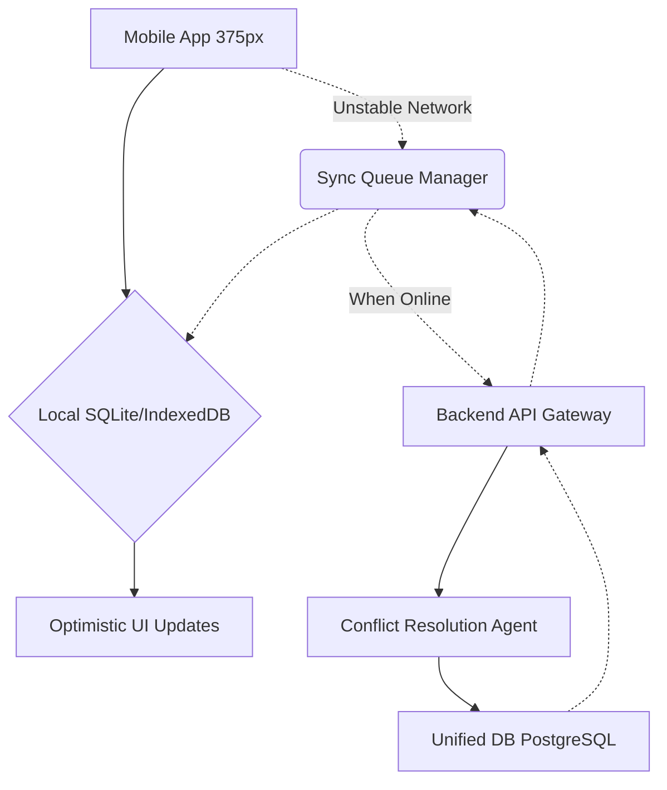

# Research Report: Automated Offline Sync and Resolution for Unstable Networks

## Problem Statement
Small business owners like Carlos the handyman or Fatima the food cart owner often operate in environments with unstable internet connections (e.g., basements, remote areas, or crowded events). Current platforms often fail silently, lose data, or block the user completely when offline. The owner needs an assistant that transparently records actions while offline and automatically synchronizes them once connectivity is restored, without requiring manual intervention or causing data conflicts. The lack of offline support causes missed orders, lost service updates, and frustration.

## Research Report
**Findings & Competitive Analysis:**
- **Traditional SaaS (e.g., Shopify POS, Square):** Often have basic "offline mode" for taking payments or recording orders, but they are typically rigid, requiring manual syncing or only working for specific features like POS. They do not offer a comprehensive, platform-wide offline-first architecture.
- **Modern App Architecture (e.g., Linear):** Linear uses an offline-first architecture where every action is a local mutation that syncs optimistically to the server. This provides a fast, seamless experience regardless of network status.
- **OHC Opportunity:** Implement an "Offline First & Sync" capability across the mobile-first platform. This involves using local first databases (like SQLite or IndexedDB) with an optimistic update strategy, combined with an AI conflict resolution agent to handle any sync issues intelligently when reconnecting. This ensures Carlos can update a job status in a basement, and it automatically syncs to the central database when he drives away.

## Design Doc
### Architecture Diagram

### UI Wireframes & Mobile UX Flow (375px First)
- **Global Header (Mobile):** Add an elegant, subtle indicator for connection status. When offline, a small, non-intrusive "Working Offline" pill appears. When syncing, it changes to "Syncing..." and then disappears upon success.
- **Interaction:** The user interacts with the app normally. Tapping "Complete Job" updates the UI instantly, regardless of connection.
- **Action:** If a conflict occurs during sync (e.g., another device updated the same record), the Conflict Resolution Agent attempts auto-resolution. If it cannot, a card appears in the Agent Feed: "Sync Conflict for Job #123. Review needed."
- **Visual Design:** Translucent glass materials. Status pills use semantic colors (e.g., warning yellow for offline, success green for synced momentarily).

### AI Agent Integration Points
- **Conflict Resolution Agent (The Conciliator):** Triggered when the backend detects a version mismatch or conflicting update during a sync operation from the Sync Queue Manager. It uses heuristics and context (e.g., timestamp, user role, entity type) to automatically resolve conflicts when safe, and only escalates to the owner via the Agent Feed when necessary.

### Key Design Decisions
- **Offline First:** All reads and writes go to the local database first. The UI is always driven by the local state, ensuring zero latency and full offline capability.
- **Optimistic Updates:** Actions appear complete instantly to the user.
- **Agentic Resolution:** Offload the burden of resolving complex sync conflicts from the user to an AI agent whenever possible.
