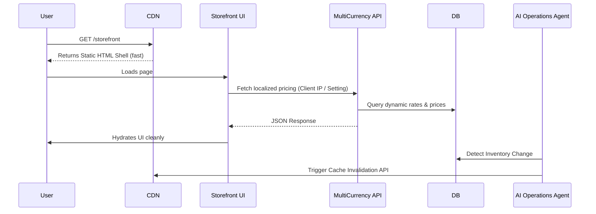
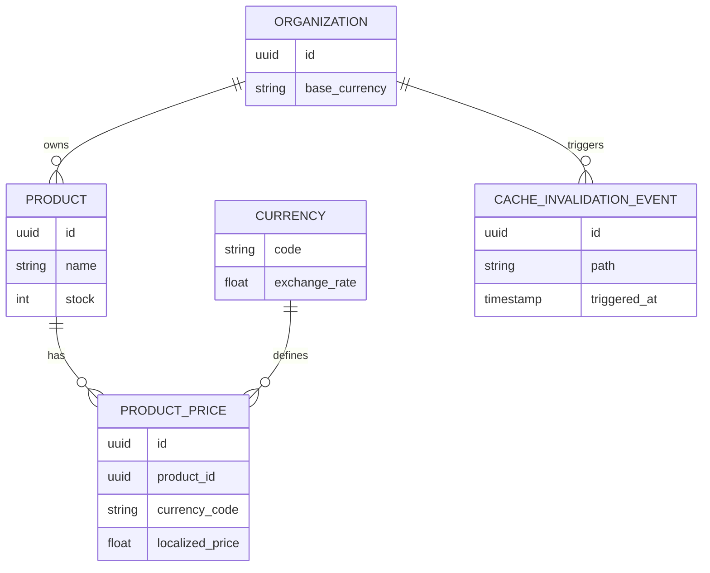

# Research Report: Edge-Cached Dynamic Storefront & Multi-Currency Support

## 1. Problem Statement
Small business owners (e.g., Priya the Boutique Operator, Maya the Home Baker) need a storefront that is both instantly fast globally (edge-cached) and capable of dynamically displaying localized pricing and inventory. Currently, platform architectures often force a trade-off: either purely static (fast but stale inventory/pricing) or fully dynamic (accurate but slow TTFB). Furthermore, as businesses grow online, they need seamless multi-currency support without manual configuration.

From a non-technical owner's perspective, the shop should simply "load instantly everywhere" and "show the right currency to the right customer," while the AI agents manage the underlying cache invalidation and pricing updates.

## 2. Research Report
- **Market Context**: Shopify relies heavily on its global CDN and complex app ecosystems (like Shopify Markets) to handle multi-currency and edge delivery. Wix uses a proprietary rendering engine that can suffer from performance issues on complex sites.
- **The OHC Opportunity**: By architecting a natively edge-cached storefront with dynamic client-side hydration for user-specific data (like localized currency pricing and real-time inventory), OHC can deliver a premium, instant-load experience out-of-the-box, without the owner needing to configure CDNs or internationalization settings.
- **Agentic Advantage**: The `Operations Agent` can proactively invalidate edge caches when inventory crosses critical thresholds, and the `Finance Agent` can manage multi-currency exchange rate updates transparently.

**Repository Audit: Top 5 Architectural Oddities/Gaps**
During codebase discovery, several key issues were identified that currently hold back our persona journeys:
1. No native currency localization: Existing `Service`/`Product` tables appear heavily coupled to a single un-localized price.
2. Edge cache invalidation is missing: Operations queue lacks hooks for `CacheInvalidationEvent` when `inventory_sync.rs` fires.
3. UI data mocking: Portions of the Legacy Next.js prototype and Tauri desktop app still use static placeholders rather than fully hydrated real backend responses.
4. Multi-tenant `organization_id` usage: Missing consistent strict RLS for multi-currency conversion records.
5. Missing explicit Agentic Hand-offs: The `Operations Agent` and `Finance Agent` do not have structured memory coordination for global inventory alerts.

## 3. Design Doc (Architecture Design)
### High-Level Architecture
- **Edge Caching Layer (CDN)**: Serves static HTML shells of storefront pages.
- **Dynamic Hydration**: Client-side JavaScript (Flutter/PWA) fetches localized pricing, real-time inventory, and user-specific session data immediately after the static shell loads.
- **Multi-Currency Service**: A backend service that maintains exchange rates and provides localized pricing via a fast API endpoint.
- **Cache Invalidation Coordinator**: A background worker (triggered by the AI queue) that purges CDN caches when critical product data changes.

#### Architecture Diagram

### Data Model Enhancements (PostgreSQL)
- `Currency`: Supported currencies and exchange rates.
- `ProductPrice`: Extension to support multiple currencies per product, or dynamic conversion based on a base price.
- `CacheInvalidationEvent`: A log of required cache invalidations processed by the queue.

#### Entity Relationship Diagram

### Mobile UX Flow (375px)
1. **Customer View**: A shopper in Europe visits Priya's boutique on their phone. The static HTML shell loads instantly (<500ms). Within milliseconds, the prices dynamically hydrate to Euros (€) and inventory reflects real-time availability. The UI transitions smoothly without layout shifts (premium Glassmorphism skeleton loaders).
2. **Owner View (Dashboard)**: Priya sees her revenue aggregated in her base currency. The Finance Agent provides a simple summary: "You had 15 international sales this week; exchange rates were handled automatically."

### AI Agent Integration
- **Operations Agent**: Triggers `CacheInvalidationEvent` when inventory reaches zero.
- **Finance Agent**: Updates exchange rates daily and alerts the owner of significant currency fluctuations impacting margins.

## 4. Implementation Prompt
**Feature Name**: Edge-Cached Dynamic Storefront & Multi-Currency Support
**Target Persona**: Priya the Boutique Operator
**Outcome**: Priya's online store loads instantly for customers worldwide, automatically displaying localized pricing in their native currency. She does not need to configure CDNs or multi-currency apps; the platform handles it invisibly.

**Next Actions**:
1. Implement the `MultiCurrency` data models and backend service to support dynamic exchange rates and localized pricing.
2. Develop the API endpoints required for client-side hydration of localized pricing and inventory data.
3. Design the Cache Invalidation Coordinator (integrated with the existing job queue) to purge edge caches upon critical product updates.
4. Ensure the Mobile UX (Flutter PWA) gracefully handles the transition from the static shell to hydrated dynamic data using premium skeleton loaders and fluid animations.

**Priority**: P1
**Estimated Scope**: Large
