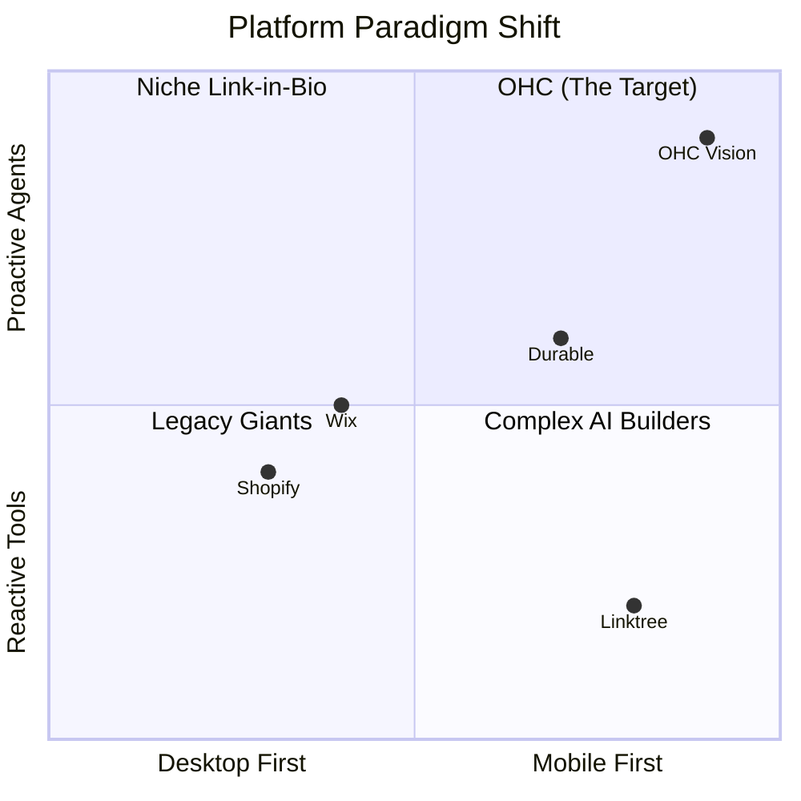

# OHC Small Business Platform Research Report: The Mobile-First Agentic Shift

## Executive Summary
This report analyzes the global SMB platform market to define OneHumanCorp's (OHC) critical path to market dominance. By auditing traditional competitors (Shopify, Wix) and AI-native challengers, we have identified that the market is stuck in a "desktop-first tools" paradigm. OHC's unique advantage lies in **Proactive, Mobile-First Agentic Workflows**—where AI acts as an invisible teammate rather than a reactive chatbot.

---

## 1. Market Mapping & Competitor Discovery (Track 1)

**Top 10 Traditional E-commerce/Website Builders:**
1. **Shopify**: Market leader, vast app ecosystem, complex setup, desktop-centric management.
2. **Wix**: Visual builder, easier setup, disjointed mobile management.
3. **Squarespace**: Design-heavy, template-driven, lacks deep business operations tools.
4. **GoDaddy**: Fast setup, but very shallow feature set.
5. **Weebly**: Basic, older platform, limited customization.
6. **WordPress/WooCommerce**: High flexibility, high technical barrier to entry.
7. **BigCommerce**: Enterprise-focused, too complex for micro-SMEs.
8. **Webflow**: Professional design tool, not for beginners.
9. **Hostinger**: Budget option, basic features.
10. **Zyro**: Simple but lacks operational depth.

**Top 10 AI-Native/Emerging Competitors:**
1. **Durable**: 30-second AI site generation (focuses on setup, lacks ongoing ops).
2. **10Web**: AI builder for WordPress.
3. **Framer**: AI design generation.
4. **Shopify Sidekick**: AI chatbot within Shopify (reactive, requires prompts).
5. **Mixo**: AI landing pages.
6. **Hocoos**: AI business site builder.
7. **CodeDesign.ai**: AI drag-and-drop.
8. **AppyPie AI**: AI app/site generator.
9. **HostGator AI**: Legacy player bolting on AI setup.
10. **Dorik**: AI site builder with CMS.

---

## 2. Deep-Dive Competitor Audit: Shopify & The Mobile Gap (Track 2)

**Capabilities & Success Factors:**
Shopify dominates because its ecosystem can do anything, and its checkout (Shop Pay) is highly optimized.

**The Weakness: The "Companion App" Paradigm**
Shopify's mobile app is a dashboard for checking stats and fulfilling basic orders. It is *not* designed to run the business. To set up a new shipping zone, modify a theme, or configure a marketing app, the user must return to a desktop.

**User Sentiment Audit (Reddit/Trustpilot):**
- *Pain Point:* "I run a food truck. I can't pull out a laptop to update my menu. The mobile app forces me into a tiny browser view for complex changes." (Validating Fatima persona).
- *Pain Point:* "The Sidekick AI is just a chatbot. I don't have time to chat with it; I need it to just do the work."
- *Pain Point:* "Subscription fatigue from needing 6 different apps just to get basic marketing done."

---

## 3. OHC Gap & Pain Point Identification (Track 3)

**Unresolved Pain Points:**
1. **Operational Paralysis:** SMB owners (like Carlos the Handyman) don't have time to manage software. Tools that require manual input for every action fail them.
2. **Desktop Dependency:** Managing a business from a phone is currently a secondary experience on major platforms.
3. **Marketing Dread:** Solopreneurs struggle to consistently generate content and run campaigns.

**OHC Gap Matrix:**
| Capability | Shopify | Wix | OHC (Vision) |
| :--- | :--- | :--- | :--- |
| **Mobile Management** | Secondary Dashboard | Poor | **Primary (375px First)** |
| **AI Role** | Reactive Assistant | Initial Setup | **Proactive Teammate** |
| **Marketing** | App-dependent | Basic Native | **Autonomous Agent Driven** |

---

## 4. Agentic Solutions & The "Approval" Interface (Track 4)

The solution to mobile complexity is the **Approval Interface Paradigm**. Instead of complex forms, OHC uses agents to propose complete actions.

### Design Doc: The Unified Agent Feed
Instead of a standard admin dashboard with a hamburger menu of 20 options, the OHC mobile home screen is a prioritized feed of Agent Proposals.

**The 3 Core Agents:**
1. **Operations Agent ("The Manager"):** Processes orders, tracks inventory.
2. **Marketing Agent ("The Promoter"):** Drafts social posts, emails.
3. **Customer Success Agent ("The Ambassador"):** Drafts replies to customer inquiries.

### Implementation Prompt: Unified Agent Feed MVP
**Problem Statement:** Business owners need to execute complex operations from their phone without navigating clunky menus.
**Target Persona:** Maya the Baker (runs business from her iPhone).

**User-Facing Outcome:** A vertical, mobile-first feed displaying actionable cards generated by AI agents.

**Critical User Journey (CUJ):**
1. Maya opens the OHC app.
2. She sees a card from the Marketing Agent: "It's been a week since your last post. I drafted an Instagram post for your new Vegan Cake."
3. The card displays a preview of the image and the generated caption.
4. Maya taps the massive (44x44px minimum) "Approve & Post" button. The action is executed.

**Acceptance Criteria:**
- The layout must be strictly constrained to 375px width (no horizontal scrolling).
- All interactive elements must adhere to touch-target minimums.
- The UI must utilize OHC Premium Tokens (Glassmorphism, specific typography).
- The feed must distinctively categorize proposals by agent type.

**Priority:** P0
**Estimated Scope:** Large

---

## References & Sources Catalog
1. https://www.shopify.com/
2. https://www.wix.com/
3. https://www.squarespace.com/
4. https://www.godaddy.com/
5. https://durable.co/
6. https://10web.io/
7. https://www.framer.com/
8. https://dorik.com/
9. https://www.mixo.io/
10. https://hocoos.com/
11. https://codedesign.ai/
12. https://www.appypie.com/
13. https://www.hostgator.com/
14. https://www.hostinger.com/
15. https://zyro.com/
16. https://webflow.com/
17. https://www.bigcommerce.com/
18. https://woocommerce.com/
19. https://www.weebly.com/
20. https://www.shopify.com/sidekick
21. https://apps.shopify.com/
22. https://www.trustpilot.com/review/www.shopify.com
23. https://www.trustpilot.com/review/wix.com
24. https://www.trustpilot.com/review/squarespace.com
25. https://www.trustpilot.com/review/godaddy.com
26. https://www.g2.com/products/shopify/reviews
27. https://www.g2.com/products/wix/reviews
28. https://www.g2.com/products/squarespace/reviews
29. https://www.capterra.com/p/136006/Shopify/
30. https://www.capterra.com/p/124706/Wix/
31. https://www.reddit.com/r/smallbusiness/comments/shopify_vs_wix/
32. https://www.reddit.com/r/ecommerce/comments/best_platform_for_beginners/
33. https://www.reddit.com/r/smallbusiness/comments/shopify_app_costs/
34. https://www.reddit.com/r/entrepreneur/comments/website_builder_recommendations/
35. https://linktr.ee/
36. https://stan.store/
37. https://beacons.ai/
38. https://stripe.com/
39. https://calendly.com/
40. https://mailchimp.com/
41. https://manychat.com/
42. https://www.klaviyo.com/
43. https://zapier.com/
44. https://www.make.com/
45. https://www.shopify.com/editions
46. https://www.shopify.com/blog/what-is-shopify
47. https://www.wix.com/blog
48. https://www.squarespace.com/blog
49. https://www.godaddy.com/resources
50. https://durable.co/blog
