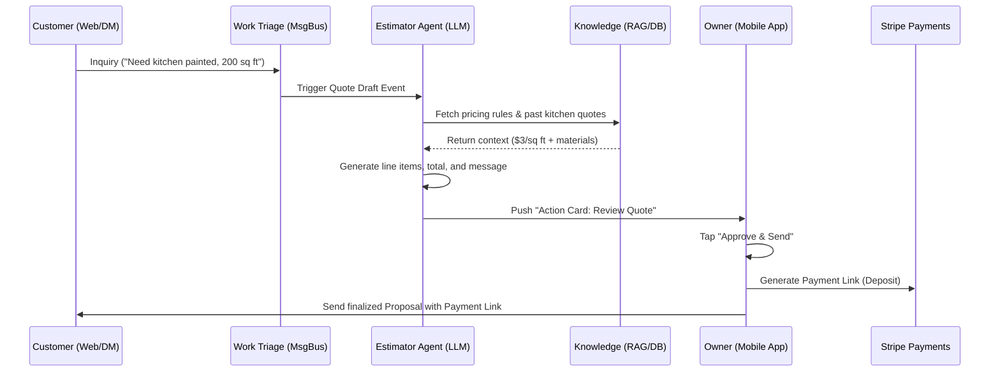

# OmniSolo AI-Powered Autonomous Quoting and Proposal Generation (The Estimator Agent)

## 1. Problem Statement
Service-based and project-based small business owners—like Carlos (Field Service/Handyman) and Nora (Agency Principal)—lose significant time and revenue to the manual quoting process. Converting an ambiguous customer inquiry ("I need my bathroom fixed" or "I need a new logo") into a structured, professional proposal with accurate pricing and a deposit link is a high-friction, multi-tool process. Without technical expertise or a dedicated sales team, owners often delay responding, losing leads to faster competitors, or use disjointed tools (email, Word, generic invoicing apps) that break the customer experience.

## 2. Research Report
- **Market Context**: Traditional tools like Jobber (field service) or HoneyBook (creatives) offer proposal templates, but they still require the owner to manually translate customer needs into line items, calculate totals, and configure payment gateways. Shopify and Wix lack native, flexible quoting for bespoke services.
- **The OmniSolo Opportunity**: By leveraging the "Estimator Agent" (part of the Sales & Revenue Assistant), OmniSolo can ingest raw customer intent (via email, WhatsApp, or form), query the owner’s historical pricing and service catalog via RAG, and instantly draft a professional, payable quote for the owner to approve with one tap.
- **Competitor Gaps**:
  - *HoneyBook/Dubsado*: Heavy onboarding, requires manual proposal building.
  - *Jobber/ServiceTitan*: Expensive, overly complex for a 1-person shop, lacks autonomous AI drafting.
  - *Shopify/Wix*: Built for fixed-price SKUs, extremely poor at handling dynamic, consultative service quoting.

## 3. Design Doc

### Architecture Diagram

### Data Model (PostgreSQL)
- `QuoteRequest`: Tracks the raw inbound lead/inquiry.
- `Quote`: The generated proposal structure (linked to Tenant, Customer).
- `QuoteLineItem`: Dynamically generated services, quantities, and prices.
- `PaymentIntent`: Stripe integration for deposit/full payment upon quote acceptance.

### AI Agent Integration (The Estimator)
- **Trigger**: New message classified as a "Service Inquiry" by the Work Triage system.
- **Context Gathering (RAG)**: Retrieves the tenant's service pricing guidelines, past accepted quotes for similar work, and available schedule blocks.
- **Action**: Drafts a structured JSON quote and a friendly accompanying message, dispatching it to the owner's OmniSolo feed.

### Mobile UX Flow (375px)
1. **Notification**: Owner receives a push: "New Quote Drafted for John (Kitchen Painting)."
2. **Review Card**: A clean, touch-friendly card (Ubiquiti-style layout) displays the drafted message and a summary of line items.
3. **Edit/Adjust**: Tapping a line item allows quick native-keyboard adjustments to price or description.
4. **One-Tap Send**: Owner taps the primary "Approve & Request Deposit" button. The system generates a Stripe checkout link and sends the message.
5. **Customer View**: Customer receives a mobile-optimized web link displaying the proposal, accepting Apple Pay/Google Pay for instant deposit.

## 4. Implementation Prompt
**Feature Name**: OmniSolo Autonomous Quoting System

**Target Persona**: Carlos (Handyman) and Nora (Agency Principal)

**Outcome**: When a customer inquiry arrives, the Estimator Agent automatically drafts a structured, itemized quote based on past pricing. The owner reviews the quote in a mobile-optimized card and approves it with one tap, instantly sending a deposit payment link to the customer.

**Acceptance Criteria (CUJ)**:
1. Simulate an incoming customer inquiry via the `Work Triage` queue.
2. The `Estimator Agent` must intercept the event, query the mock service catalog, and generate a draft quote with at least two line items.
3. The drafted quote must appear in the owner's mobile feed (`375px` responsive view).
4. The owner can click "Approve", which updates the quote status to `SENT` and integrates with the `billing` module to generate a payment link.
5. Include E2E Playwright tests simulating the owner reviewing and approving the quote on a mobile viewport.
