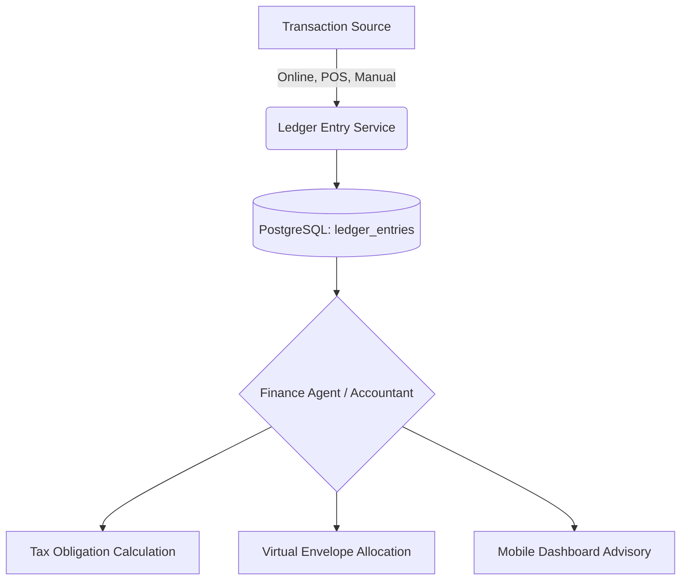

# Research Report: Universal Embedded Finance & AI Taxation Ledger

## 1. Deep Competitor Audit & Gap Analysis

This section analyzes how primary competitors handle the critical aspects of embedded finance, automated taxation, and cross-channel revenue tracking for small businesses.

### Primary Competitors
*   **Shopify:** Offers Shopify Payments and basic tax calculations, but often requires expensive third-party apps (like Avalara or TaxJar) for complex multi-jurisdiction compliance. **Weakness:** Complex setup for sales tax nexus and reliance on external financial tools for true business ledger capabilities.
*   **Wix:** Basic payment processing and manual tax rate setup. **Weakness:** Lacks deep automated financial reconciliation and predictive tax planning.
*   **Square:** Excellent at point-of-sale and immediate payment processing. **Weakness:** Operates largely as a payment processor rather than an autonomous financial advisory agent; tax reporting is reactive.
*   **QuickBooks/Xero:** The gold standard for accounting, but built for accountants, not the business owner. **Weakness:** Requires technical accounting knowledge, high friction for non-technical users to set up correctly.

### The OHC Gap
Currently, OHC lacks a unified, invisible financial nervous system that can autonomously handle cross-channel revenue (online, POS, manual entry), automatically set aside estimated taxes, and provide real-time, plain-language financial health insights without requiring a separate accounting platform.

## 2. Universal Embedded Finance Architecture

To dominate the market, OHC must build a "Finance & Payments" department that acts as an invisible, autonomous "Accountant" agent.

### Core Capabilities
1.  **Unified Cross-Channel Ledger:** A single source of truth for all transactions (Stripe online, Stripe Terminal POS, manual cash entries) synced in real-time to a PostgreSQL `ledger_entries` table with strict row-level security.
2.  **Autonomous Tax Engine:** Real-time calculation of sales tax based on customer geolocation (using Stripe Tax or an internal tax service) and automatic categorization of revenue for end-of-year income tax estimation.
3.  **Virtual Envelopes (Auto-Savings):** The ability for the AI to automatically route a percentage of every transaction into a virtual "Tax Savings" envelope, ensuring the business owner is never caught off-guard during tax season.
4.  **Plain-Language Reporting:** The Business Advisory agent translates raw ledger data into actionable insights (e.g., "You have $1,200 set aside for taxes this quarter. Your profit margin on vegan cakes is 15% higher than regular cakes.").

### Architecture Diagram

### Mobile UX Flow
1. **Dashboard Overview (375px):** A simple, unified financial health card on the main feed showing "Total Revenue", "Estimated Taxes Saved", and "Available Cash".
2. **Detailed Ledger View (375px):** A clean list of recent transactions grouped by day.
3. **Advisory Card:** A proactive notification from the Finance Agent, e.g., "You have collected $500 in sales tax this month. Move to tax savings?" with a single 44x44px "Approve" button.
4. No spreadsheets or complex double-entry forms visible on the mobile device.

## 3. Implementation Proposal

Design and implement an invisible, autonomous ledger that seamlessly calculates taxes, tracks cross-channel revenue, and automates tax savings for non-technical business owners.

- Database Schema: Design robust, immutable `ledger_entries` and `tax_obligations` tables in PostgreSQL. Ensure row-level security using `tenant_id`.
- Integration: Implement real-time sync with Stripe Issuing and Terminal for cross-channel tracking.
- AI Agent: Develop the 'Accountant' agent logic to automatically categorize transactions and estimate tax liabilities.
- Mobile UI: Design a 375px-optimized plain-language financial dashboard (no accounting jargon).
