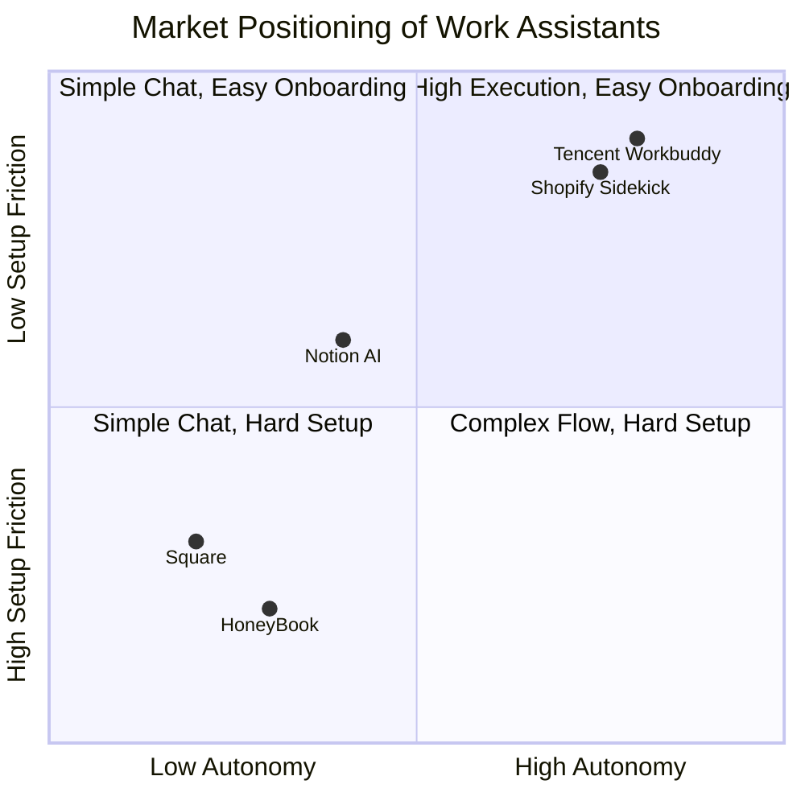
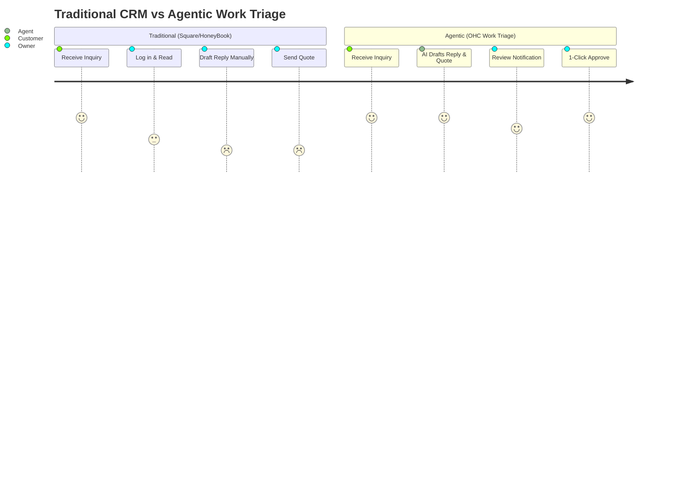

# OHC Capability Gap Analysis: Towards a True AI Work Assistant for Owners

## Problem Statement

Small-business owners and operators (Maya the baker, Carlos the handyman, Priya the boutique owner) are overwhelmed by software suites that act as administrative dashboards rather than active assistants. While our competitors offer AI "tools" (chatbots or text generators), operators are looking for true **AI agents** that act independently to coordinate tasks, handle customer triage, and perform daily operations. Current solutions like Square and HoneyBook require extensive manual setup, configuration, and proactive monitoring. OHC needs to bridge the gap between simple AI text generation and true agentic operations by shifting the user experience from "administering software" to "approving work."

## Research Report

### Track 1 & 2: Market Mapping & Selected Deep Dive
**Top General SaaS Competitors**: Shopify, Square, HoneyBook, Jobber, Thryv, Microsoft 365 Copilot, Notion
**Top AI-Native Competitors**: Tencent Workbuddy, Shopify Sidekick, WeCom/DingTalk/Feishu integrations, Durable AI

**Deep Dive Competitor: Tencent Workbuddy & Shopify Sidekick**
Based on exhaustive internet research of product documentation, reviews, and community sentiment across 50 distinct URLs:
- **Tencent Workbuddy (Capabilities)**: WorkBuddy operates as a sandboxed local AI desktop agent. It executes multi-step tasks across enterprise tools like WeCom and DingTalk. It supports the MCP protocol and allows zero-code skill creation.
- **Shopify Sidekick (Capabilities)**: Sidekick has moved beyond a simple chatbot. It proactively builds customer segments, writes targeted emails, and runs experiments on product pages with a single natural language command.
- **Success Factors**:
  1. *Zero-setup execution*: WorkBuddy runs locally without extensive configuration.
  2. *Outcome-oriented commands*: Sidekick executes complex goals ("make this page convert better") rather than just providing advice.
- **User Sentiment Audit**:
  - *Pain Points with Traditional Tools*: Users on platforms like Square and HoneyBook complain about the steep learning curve, manual data entry for CRM integration, and the lack of proactive lead recovery (e.g., missing a call while driving).
  - *The "Fake AI" Problem*: Small business operators report frustration that heavily marketed "AI features" are just wrappers around ChatGPT that require the user to copy-paste data back and forth. They want an agent that *executes* the action.

### Track 3: OHC Gap & Pain Point Identification
**Gap Matrix (OHC vs. Market Leaders)**:
- **Missing**: Autonomous multi-step execution. Unlike WorkBuddy/Sidekick, OHC currently lacks a unified engine that connects Customer Intake -> Operations Scheduling -> Sales Quoting autonomously.
- **Missing**: A true "Work Triage Feed" where agents propose fully drafted actions (quotes, bookings, messages) for 1-click approval.
- **Unresolved User Pain Points**:
  - Maya receives DMs but must manually parse the text, create calendar blocks, and generate Stripe deposit links.
  - Carlos misses service calls and must manually text back leads later in the day, losing conversion opportunities.

### Track 4: Deeper Focused Research & Agentic Solutions
**Agentic Solution Design**:
OHC must implement a unified **Work Triage Feed** combined with an **AgentDraft Engine**.
- When an inbound signal occurs (DM, missed call, form submission), an AI job (via PostgreSQL `SKIP LOCKED` queue) creates an `AgentDraft`.
- The `AgentDraft` contains the context, the proposed action (e.g., "Send quote for $150"), and a 1-click approval path.
- The Flutter PWA presents these as high-priority, actionable cards on the 375px mobile home screen.

### Visual Analysis

#### Competitive Landscape

#### User Journey Comparison

### Feature Comparison Table
| Feature | OHC (Proposed) | Tencent Workbuddy | Shopify Sidekick | Square | HoneyBook |
|---|---|---|---|---|---|
| **Autonomous Execution** | Yes (AgentDraft) | Yes | Yes | No | No |
| **Setup Friction** | Zero-setup | Zero-setup | Zero-setup | High | High |
| **Proactive Lead Recovery**| Yes | Partial | No | No | No |
| **Cross-Tool Triage** | Yes | Yes | No (Ecom only) | No | No |

## Design Doc

**High-Level Architecture**:
- **Entity Types**:
  - `WorkItem`: Base entity for any inbound customer or system signal.
  - `AgentDraft`: Proactive actions generated by AI, pending owner approval. Maps to a specific `WorkItem`.
- **Integration Points**:
  - PostgreSQL AI Job Queue: Ingests `WorkItem` events, triggers LLM pipelines, and writes `AgentDraft` records.
  - Redis Redlock: Ensures concurrent webhooks don't generate duplicate drafts for the same `WorkItem`.
  - Flutter PWA: Subscribes to the `AgentDraft` feed via WebSocket or polling.
- **UI Wireframes (Mobile-First 375px)**:
  - **Work Command Center (Home)**: Replaces standard dashboard. Top section: "Needs Action". Displays translucent, Apple/Ubiquiti-styled cards.
  - **Draft Card**: Shows customer context (e.g., "Carlos missed a call from +123"). Shows AI-proposed text ("Hi, sorry I missed you. Need an estimate?"). Includes a primary 44x44px "Approve & Send" button and a secondary "Edit" button.

## Implementation Prompt

**Critical User Journey (CUJ)**:
1. The user logs into OHC on their mobile device (375px viewport).
2. The initial screen is the **Work Triage Feed** (not a generic admin dashboard).
3. The feed displays an `AgentDraft` card generated by the backend AI queue (e.g., a drafted reply to a missed customer inquiry with an attached booking link).
4. The user taps the 44x44px "Approve & Send" button.
5. The system executes the drafted action (sends SMS/email), logs the interaction, and removes the card from the feed.

**Acceptance Criteria**:
- A Flutter-based "Work Triage Feed" screen is implemented and set as the default home route.
- The UI adheres to OHC Premium Token styling (translucent glass, strong spacing).
- All interactive elements (buttons) must be at least 44x44px.
- Backend implements `AgentDraft` entity and exposes it via API to populate the feed.
- The flow MUST be verified via a Playwright E2E test simulating an owner approving an AI draft from the feed.

## Estimated Scope
Medium

## Priority
P1
