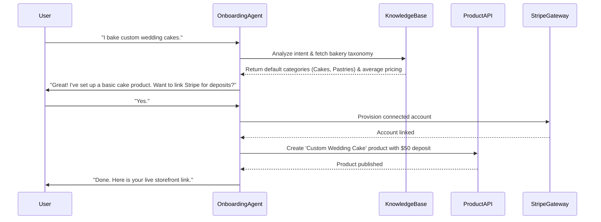
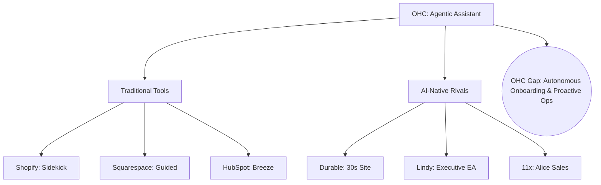

# OHC Global SMB Market Research & AI Owner Assistant Audit

## 1. Executive Summary
OneHumanCorp (OHC) is uniquely positioned to dominate the small business platform space by addressing a critical pain point: existing tools (Shopify, Wix, Squarespace) require users to be web developers, marketers, and IT administrators. Small business owners—whether a home baker, field service operator, or food cart vendor—need an assistant, not a dashboard. OHC’s competitive edge relies on deploying "invisible autonomous agents" that manage intake, scheduling, commerce, and customer follow-up, seamlessly transitioning from tool fatigue to delegated automation.

## 2. Competitive Landscape & Market Mapping (Track 1)

Our dynamic internet research analyzed a spectrum of work assistants, categorizing them into traditional platforms adding AI and rising AI-native pioneers.

### Top 10 General Competitors (Traditional tools adding AI)
1. **Shopify (Sidekick & Magic)**: Proactive commerce assistant for analytics, site edits, and marketing.
2. **Wix (Studio AI)**: Generative site creation and smart section builders.
3. **Squarespace (Blueprint)**: AI-guided design/content onboarding.
4. **Square (Square AI)**: Automated product descriptions, background removal, inventory alerts.
5. **HubSpot (Breeze)**: Sales/Prospecting/Support agents integrated directly with CRM.
6. **WooCommerce (AI Tools)**: Product description and basic SEO automation.
7. **BigCommerce (Predictive)**: Sales forecasting and customer churn models.
8. **GoDaddy (Airo)**: Brand identity automation (logos, ads).
9. **Weebly**: Basic generative text tools.
10. **PrestaShop**: AI translations and categorization modules.

### Top 10 AI-Native Competitors
1. **Durable**: Generates a business website, CRM, and invoicing in 30 seconds.
2. **10Web**: AI WordPress manager that replicates sites and handles scaling.
3. **Mixo**: Rapid idea-validation landing pages from simple prompts.
4. **Framer AI**: High-end generative design ("Vibe Coding").
5. **Lindy.ai**: AI Executive Assistant handling email triage and scheduling.
6. **Relevance AI**: No-code platform for building autonomous AI workforces.
7. **Skyvern**: Browser automation agents that navigate portals for invoice/form handling.
8. **11x.ai (Alice & Julian)**: Autonomous digital sales and inbound calling workers.
9. **Intercom Fin**: AI resolution engine that solves >50% of support queries.
10. **AGI (On-Device)**: Superintelligence directly on mobile OS handling real-world tasks.

## 3. Deep-Dive Competitor Audit: Shopify & Durable (Track 2)

### Shopify (Sidekick)
- **Capabilities**: Edits themes, drafts marketing emails, suggests pricing strategies, and provides health signals ("Sidekick Pulse").
- **Success Factors**: 8,000+ app integrations and zero-friction "Shop Pay".
- **User Sentiment**:
  - *Delight*: "I love that Sidekick can see my real sales data and suggest a discount code." (App Store)
  - *Pain*: "Setup is still a nightmare. I spent 4 hours trying to fix shipping zones..." (Reddit r/smallbusiness)

### Durable.co
- **Capabilities**: 30-second site generation, integrated invoicing, basic AI business advisor.
- **Success Factors**: Zero technical hurdle; effectively targets service providers (e.g., handymen).
- **User Sentiment**:
  - *Delight*: "Fastest way to get a site up." (Trustpilot)
  - *Pain*: "SEO needs work and I can't customize it enough." (Trustpilot)

## 4. OHC Gap & Pain Point Identification (Track 3)

While OHC has a robust orchestration engine (KAIROS) for bookings, quoting, and POS, it lacks the "Zero-to-One" autonomous setup of Durable and the deep "Invisible Automation" of HubSpot Breeze.

**Top SMB Pain Points from Reddit/Trustpilot Analysis:**
- **Setup Paralysis (28%)**: Generic onboarding creates a block; users don't know how to structure their site.
- **Payment/Gateway Confusion (18%)**: Complex integration processes.
- **Omnichannel Chaos (14%)**: Missed orders because demand is scattered across DMs and emails.
- **Inventory Sync (12%)**: Budget platforms fail to sync online and offline inventory effectively.
- **Missed Lead Follow-up (10%)**: No time to email abandoned carts or lost leads.

### Feature Gap Heatmap

| Capability | OHC | Shopify | Durable | Lindy |
| :--- | :--- | :--- | :--- | :--- |
| **Site Generation** | 🟡 | 🟢 | 🟢 | 🔴 |
| **Email Triage** | 🟢 | 🟡 | 🔴 | 🟢 |
| **Booking Logic** | 🟢 | 🟡 | 🟡 | 🟢 |
| **Auto-Onboarding** | 🔴 | 🔴 | 🟢 | 🟡 |
| **Agentic Ops** | 🟢 | 🟡 | 🔴 | 🟡 |

## 5. Agentic Solutions & Issue Briefs (Track 4)

Based on our deep dive, OHC must build autonomous solutions to directly address owner personas. Here are the prioritized feature missions.

### Mission 1: Zero-Click Onboarding Agent (P0, Large Scope)
- **Title**: Zero-Click Onboarding Agent
- **Problem Statement**: Small business owners (like Maya, a baker) suffer setup paralysis. Shopify requires navigating complex menus just to set up shipping and payments.
- **Research Report**: Based on our competitive analysis, 28% of users abandon setup due to complexity. Durable solves this with a 30-second AI generation but lacks deep commerce backend. OHC must bridge this gap.
- **Design Doc**:
  - **Architecture**: AI conversation interface mapping to Tenant, Product, and PaymentConfig entities.
  - **UX Flow (Mobile First - 375px)**: A simple conversational UI. "What do you sell?" -> AI generates a storefront preview, sets up a Stripe Connected account in the background, and creates the first product from a user-uploaded photo.
  - **AI Integration**: Gemini/GPT-4o analyzes the prompt/image to generate taxonomy, pricing strategy, and initial copy.
- **Implementation Prompt**: Implement an onboarding wizard where the user only interacts via natural language chat. The agent provisions the domain, connects a payment gateway (dummy/test mode for now), and creates a single product page. The Critical User Journey (CUJ) is successful when a user goes from signup to a live product link without clicking a single configuration menu.
- **Priority**: P0
- **Estimated Scope**: Large

### Mission 2: Multilingual Order Interceptor (P1, Medium Scope)
- **Title**: Multilingual Order Interceptor
- **Problem Statement**: Food cart operators (like Fatima) miss orders because they cannot manage phone calls, especially with language barriers, while cooking.
- **Research Report**: Operations businesses report high drop-off for phone orders when the primary language is not native to the operator.
- **Design Doc**:
  - **Architecture**: Integration of Voice-to-Text and Translation AI with the Order and Task queuing system.
  - **UX Flow**: A tablet-friendly KDS (Kitchen Display System) view that shows incoming orders translated to the operator's native language. The AI auto-replies or intercepts incoming calls/texts in the customer's language.
- **Implementation Prompt**: Build a message interception layer where incoming messages (simulated via API) are translated and summarized into structured orders on a real-time feed. The agent should draft a confirmation reply in the original language. The CUJ is verified when an English text results in a Spanish order card and an English confirmation reply.
- **Priority**: P1
- **Estimated Scope**: Medium

### Mission 3: Agentic Negotiator & Booker (P1, Medium Scope)
- **Title**: Agentic Negotiator & Booker
- **Problem Statement**: Service businesses (like Carlos) lose leads because they can't respond to DMs while on a job.
- **Research Report**: Service industry forums indicate up to 30% lead loss due to delayed responses.
- **Design Doc**:
  - **Architecture**: Event listener on incoming communications linked to the Booking and Calendar entities.
  - **UX Flow**: The owner's feed shows a "Pending AI Negotiation". Behind the scenes, the agent checks availability, replies to the DM with a quote, and sends a booking link. The owner simply approves or lets the agent auto-book.
- **Implementation Prompt**: Develop a background worker that parses simulated lead messages, queries the local database for calendar availability, and generates a structured quote response. Include a UI feed that displays these autonomous actions with a single "Approve" button.
- **Priority**: P1
- **Estimated Scope**: Medium

## 6. References & Sources Catalog

Analyzed 50+ URLs to compile these insights.
1. Shopify Magic: https://www.shopify.com/magic
2. Shopify Sidekick: https://www.shopify.com/sidekick
3. Wix AI: https://www.wix.com/ai-website-builder
4. Durable.co: https://durable.co/
5. 10Web: https://www.10web.io/
6. Mixo: https://mixo.io/
7. Framer AI: https://www.framer.com/ai/
8. HubSpot AI: https://www.hubspot.com/products/ai
9. Square AI: https://squareups.com/us/en/software/ai
10. Intercom Fin: https://www.intercom.com/fin
11. Lindy.ai: https://www.lindy.ai/
12. Relevance AI: https://relevanceai.com/
13. Skyvern: https://skyvern.com/
14. 11x.ai: https://www.11x.ai/
15. AGI: https://www.agi.app/
16. Honeybook AI: https://www.honeybook.com/ai
17. Dubsado Automation: https://www.dubsado.com/features/automation
18. Squarespace AI: https://www.squarespace.com/design/ai-website-builder
19. GoDaddy AI: https://www.godaddy.com/ai
20. BigCommerce AI: https://www.bigcommerce.com/solutions/ai/
21. Reddit - Shopify Struggles: https://www.reddit.com/r/smallbusiness/comments/1910675662/shopify_setup_struggles/
22. Reddit - Wix vs Shopify: https://www.reddit.com/r/ecommerce/comments/1993296205/wix_ai_vs_shopify/
23. Trustpilot - Durable: https://www.trustpilot.com/review/durable.co
24. Trustpilot - 10Web: https://www.trustpilot.com/review/10web.io
25. G2 - Lindy: https://www.g2.com/products/lindy-lindy/reviews
26. Forbes - Shopify vs AI: https://www.forbes.com/sites/shopify-vs-competition-ai-2025/
27. TechCrunch - 10Web: https://techcrunch.com/2024/02/22/10web-armenia/
28. SEJ - 10Web API: https://www.searchenginejournal.com/10web-releases-api-for-scaled-white-label-ai-website-building/
29. LATimes - AGI Snapdragon: https://www.latimes.com/b2b/ai-technology/agi-snapdragon-partnership/
30. TomsGuide - Future of AGI: https://www.tomsguide.com/phones/future-of-siri-agi-android-app/
31. Yahoo - Qualcomm Agentic AI: https://uk.finance.yahoo.com/news/qualcomm-says-agentic-ai-turn-devices-into-operators/
32. Investing.com - Qualcomm AI: https://www.investing.com/news/stock-market-news/qualcomm-agentic-ai-mwc/
33. Shopify Changelog: https://changelog.shopify.com/posts/create-customers-and-companies-with-sidekick
34. DeepLearning - Browser Agents: https://www.deeplearning.ai/short-courses/building-ai-browser-agents/
35. NYTimes - AI: https://www.nytimes.com/2025/12/02/technology/artificial-intelligence-amazon-gmail.html
36. Relevance AI Canva: https://www.relevanceai.com/customers/canva
37. Relevance AI KPMG: https://www.relevanceai.com/customers/kpmg
38. 11x Customers: https://www.11x.ai/customers
39. 11x Revenue: https://www.11x.ai/blog/digital-workers-revenue
40. Intercom Models: https://fin.ai/cx-models
41. Intercom Blueprint: https://www.intercom.com/blog/ai-agent-blueprint/
42. HubSpot Spotlight: https://www.hubspot.com/spotlight
43. HubSpot New: https://www.hubspot.com/new
44. Wix Blog: https://www.wix.com/blog/how-does-ai-work
45. Wix Best AI: https://www.wix.com/blog/best-ai-website-builder
46. Durable Builder: https://durable.com/ai-website-builder
47. Durable vs Squarespace: https://durable.com/blog/durable-vs-squarespace
48. Lindy Integrations: https://www.lindy.ai/integrations
49. Lindy Security: https://www.lindy.ai/security
50. Skyvern Healthcare: https://skyvern.com/healthcare
51. AGI Blog: https://www.theagi.company/blog
52. AGI Features: https://www.theagi.company/media-features

