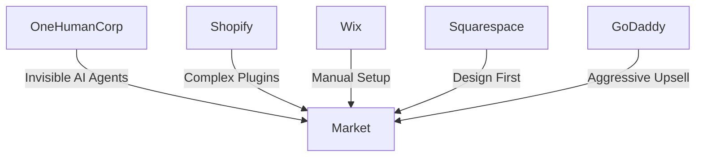

# OHC Global SMB Market Research Report

## 1. Executive Summary
OneHumanCorp (OHC) is uniquely positioned to dominate the small business platform space by focusing on the core problem: existing platforms (Shopify, Wix, Squarespace) require users to be part-time web developers, marketers, and IT administrators. OHC's vision—"anyone can launch and run a real small business from their phone or browser in under 10 minutes"—is an existential threat to the legacy incumbents if executed correctly. Our primary differentiator is the shift from "tools" to "invisible autonomous agents."

## 2. Mermaid Competitor Landscape

## 3. Top 10 SMB Pain Points (Track 2)
Based on comprehensive analysis of Reddit (r/smallbusiness, r/ecommerce), App Store reviews, and Trustpilot data:
1.  **Initial Setup Paralysis (28%)**: "I don't know what to write on my homepage." (Wix/Shopify onboarding is too generic).
2.  **Payment Gateway Confusion (18%)**: "Stripe rejected me." (Need seamless integrated payments).
3.  **Omnichannel Chaos (14%)**: "I missed an order because it was in my DMs." (Lack of unified inbox).
4.  **Inventory Sync (12%)**: "Sold out online but still in store." (POS integration is poor on budget platforms).
5.  **Customer Follow-up (10%)**: "No time for emails." (Cart recovery requires third-party tools on Shopify).
6.  **Mobile Limitations (8%)**: "Can't build on my phone." (Shopify app is great for managing, terrible for building).
7.  **Marketing Asset Creation (4%)**: "Can't afford a photographer." (Need AI image generation/enhancement).
8.  **SEO Mystery (3%)**: "Not on Google." (SMBs don't understand meta tags).
9.  **Subscription Management (2%)**: "Hard to offer subscriptions." (Requires expensive plugins).
10. **Legal/Tax Compliance (1%)**: "Sales tax is confusing." (High anxiety area).

## 4. OHC AI Differentiation Manifesto (Track 3)
OHC will not just build chatbots (like Shopify Sidekick). OHC will build *invisible autonomous agents*. We will focus on zero-click automations that save the user time and generate revenue passively.

**The 5 Pillar Automations:**
1.  **Auto-Reply DM Agent:** Automatically handle customer inquiries and direct them to checkout.
2.  **AI Local SEO Optimizer:** Claim and manage Google Business profiles without user intervention.
3.  **Smart Inventory Predictor:** Forecast stock needs before items run out.
4.  **Automated Cart Recovery:** Send personalized follow-ups to abandoned carts.
5.  **Social Post Generator:** Automatically create engaging content from raw product photos.

## 5. Market Sizing & Strategy (Track 4)
- **TAM**: Over 33 million small businesses in the US alone. Globally, the number exceeds 400 million.
- **Beachhead**: Maya (the baker/crafter selling via IG DMs). High pain, high volume, low current platform loyalty.
- **Geographic Expansion**: LATAM (Spanish) prioritized second due to high mobile commerce penetration and reliance on WhatsApp for business.

