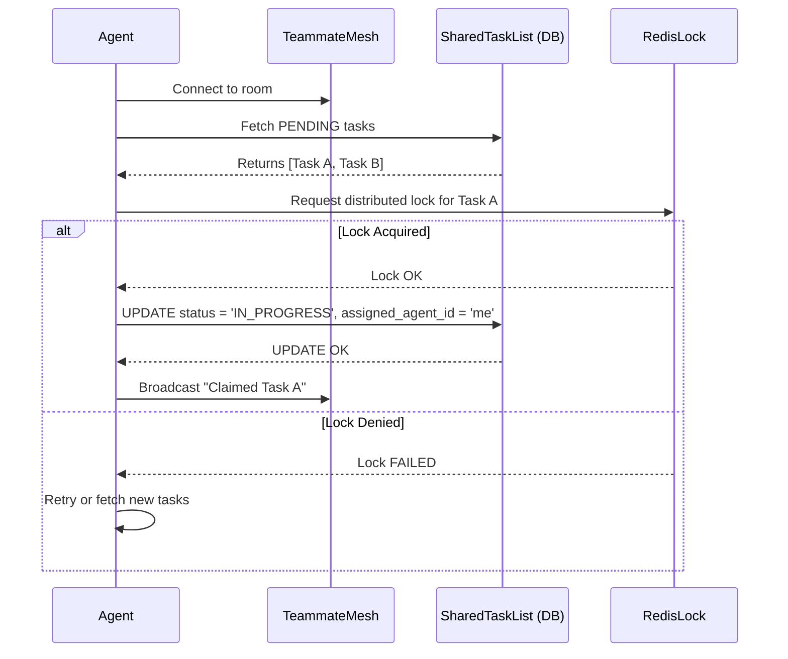

<div markdown="1" style="backdrop-filter: blur(20px) saturate(200%); font-family: Outfit, Inter, sans-serif; border: 1px solid rgba(255, 255, 255, 0.1); padding: 20px; border-radius: 12px; background: rgba(255, 255, 255, 0.05);">

# 🌐 Teammate Mesh & Shared Task List Documentation

**Version:** 1.0.0
**Target Audience:** Orchestration Engineers, AI Agents, & Human CEOs

## 1. Introduction
The One Human Corp (OHC) Swarm relies on the **Teammate Mesh** and **Shared Task List** to enable real-time communication and collaborative task management. This documentation details the architectural concepts and API integrations for the Teammate Mesh and Shared Task List.

## 2. Shared Task List Architecture
The Shared Task List is the backbone of autonomous task execution, utilizing distributed state machines.

*   **Cloud-Native Mode:** Uses PostgreSQL row-level locks to prevent race conditions when multiple agents attempt to claim tasks simultaneously.
*   **Standalone Mode:** Degrades gracefully to SQLite transactions, ensuring local-to-cloud consistency via the **Hybrid OS architecture**.

### Task States
- `PENDING`: Ready to be claimed.
- `IN_PROGRESS`: Currently being executed by an assigned agent.
- `COMPLETED`: Successfully finished.
- `FAILED`: Execution failed or blocked.

## 3. Teammate Mesh API Contracts
The Teammate Mesh provides real-time API capabilities over WebSockets, enabling agents to coordinate seamlessly within virtual meeting rooms.

### Subscription Endpoint
Subscribe to a specific meeting room channel:
- `SUBSCRIBE /api/v1/mesh/rooms/{room_id}`

### Publish Endpoint
Broadcast messages to all connected clients in a room:
- `PUBLISH /api/v1/mesh/rooms/{room_id}/messages`

**Payload Example:**
```json
{
  "sender_id": "agent-123",
  "role": "SWE",
  "content": "I have claimed the database migration task.",
  "timestamp": "2026-04-02T10:00:00Z"
}
```

## 4. Visualizing Task Claiming Flow


---
*Powered by OHC-SIP (Swarm Intelligence Protocol)*
*Display settings: Premium Glassmorphism UI*

</div>