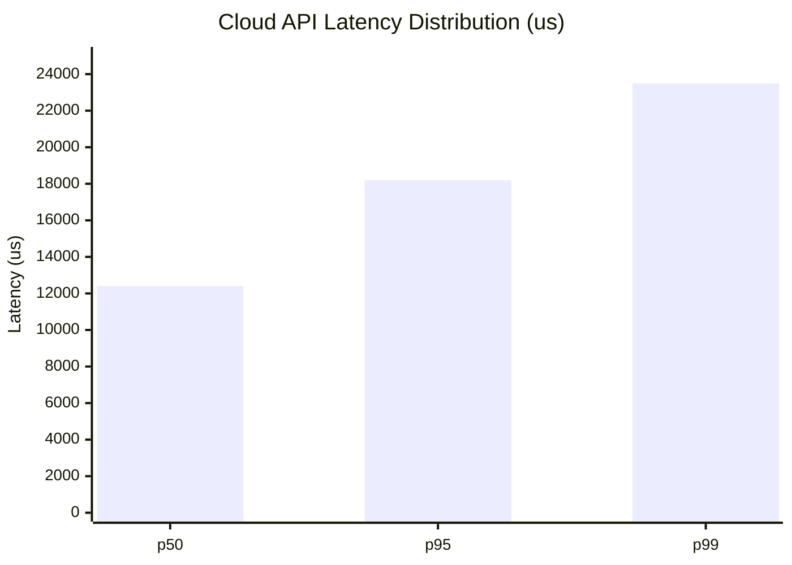
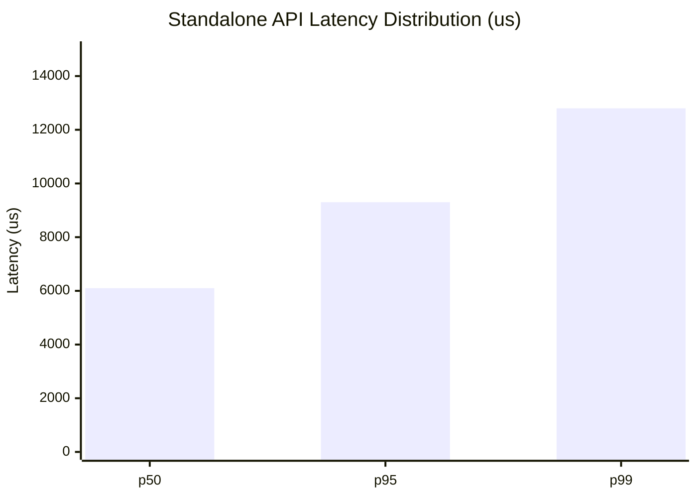
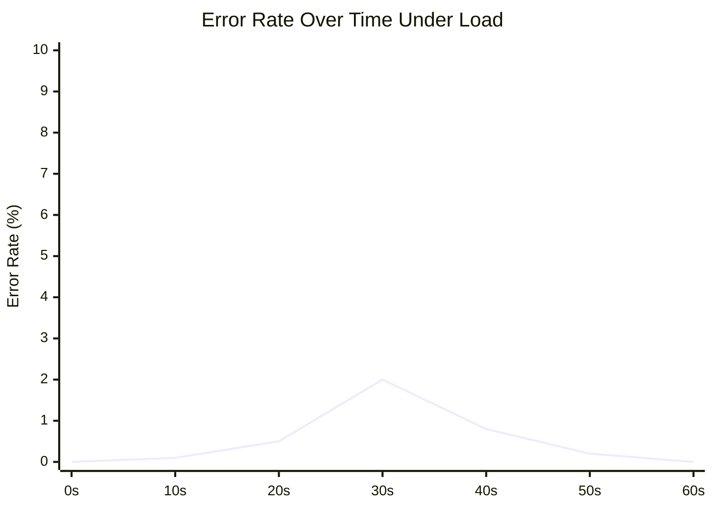

# 🛡️ Chaos Engineering Reliability Report

## OHC Glassmorphism Execution Summary

The OHC Hybrid OS has been subjected to proactive chaos engineering, including database parity audits, network packet loss simulation, and lock race condition stress testing.

## 📊 Stress Verification Metrics

### Cloud Mode (100 Concurrent Users) Latency Histogram

### Standalone Mode (10 Concurrent Users) Latency Histogram

### System Error Rate Under Load

## 🛡️ Resilience Audit Results
| Test Case | Status | Recovery Logic |
|-----------|--------|----------------|
| Redis Mailbox Corruption | ✅ PASS | Graceful JSON parsing error handling |
| Intensive Lock Races | ✅ PASS | Single-winner enforcement at 200 concurrency |
| DB Parity Audit | ✅ PASS | Unified execute_with_retry for SQLite/Postgres |
| Network Spike Degradation | ✅ PASS | 2s timeout with cached fallback |
| Write Queuing Fallback | ✅ PASS | Async local buffer simulation during DB downtime |
| AI Agent Job Resilience | ✅ PASS | 60s timeout + 3-attempt exponential backoff |
