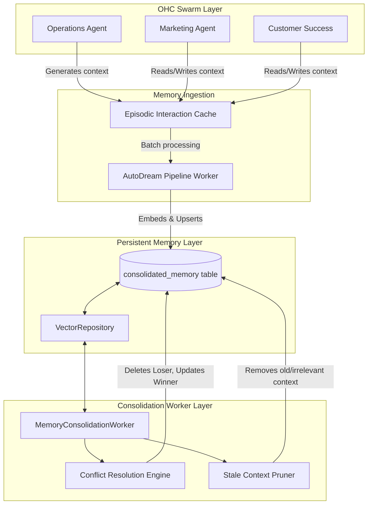

# OHC AI Agent Memory Consolidation Architecture

## Overview
One Human Corp's (OHC) AI Swarm acts as the continuous operating system for small businesses. To provide a seamless and deeply personalized experience, the AI agents must retain knowledge across sessions. This document outlines the architecture for the Persistent Memory Layer, designed to consolidate context, detect and resolve conflicting knowledge, and prune stale data automatically.

The system is designed to work in both **Cloud Mode** (PostgreSQL with `pgvector`) and **Standalone Mode** (SQLite with `sqlite-vec` or fallback local cosine distance calculations).

## Architecture Diagram

## 1. Persistent Memory Layer
The Persistent Memory Layer is the foundational system that stores embedded context for long-term retrieval.

*   **Tenant Isolation**: All memory operations are strictly scoped via `tenant_id` (or `organization_id`). A business owner's memory is never visible to another. This is enforced at the Row-Level Security (RLS) level in PostgreSQL and explicitly in Rust queries for both Postgres and SQLite.
*   **Storage Modality**:
    *   **Cloud Mode**: Uses PostgreSQL with the `pgvector` extension. Indexes (`hnsw`) are optimized for fast cosine distance lookups.
    *   **Standalone Mode**: Uses SQLite. If the `sqlite-vec` extension is available, it uses native vector search; otherwise, it falls back to an in-memory Rust cosine distance calculation.
*   **Semantic Search**: When an agent searches for "vegan cake orders", the system uses the LLM to generate an embedding for the query and searches the `consolidated_memory` table for the closest vectors.

## 2. Conflict Resolution
Over time, different departments might store conflicting information (e.g., Marketing notes a product price as $50, while Operations notes it as $55). The `MemoryConsolidationWorker` automatically detects and resolves these conflicts.

*   **Detection**: The worker periodically queries the database for memory records belonging to the same tenant that have a cosine distance of less than `0.05` (highly semantically similar).
*   **Resolution Strategy**:
    When a conflict is found between Record A and Record B, the system determines the "loser" (which gets deleted) and the "winner" (which absorbs the loser's reference count) based on the following priorities:
    1.  **Explicit Override**: If one record has `owner_override = TRUE`, it wins. This allows business owners to explicitly set a fact that the AI shouldn't forget or overwrite.
    2.  **Reliability Score**: If no explicit override exists, the record with the higher `reliability_score` wins. (e.g., a fact derived from a Stripe invoice might have a higher reliability score than a passing comment in an Instagram DM).
    3.  **Recency**: If reliability is tied, the most recently created record (`created_at`) wins.

## 3. Stale Context Pruning
To prevent the vector store from growing unbounded with irrelevant historical data, the system includes a background pruner.

*   **Conservative Pruning**: The system is highly conservative. It only deletes records that meet **all** of the following criteria:
    *   `last_referenced_at` is older than 180 days.
    *   `owner_override` is `FALSE`.
    *   `reference_count` is less than 5 (meaning it hasn't been frequently retrieved).
    *   `source_type` is `'TASK_SUMMARY'` (transitory data, rather than core business facts).
*   **Execution**: Pruning runs automatically via the `MemoryConsolidationWorker` interval loop.

## 4. Cross-Department Context Sharing
Memory is not siloed by department. Instead, all context is stored centrally in the `consolidated_memory` table, tagged with the `tenant_id`.

*   **Retrieval**: When the Business Advisory agent generates a health report, it can semantically search the entire tenant's memory space, instantly retrieving context originally written by the Customer Success agent (e.g., "Customer X was unhappy about delivery times").
*   **Reference Tracking**: Every time a memory is retrieved and utilized by any agent, its `reference_count` is incremented, and its `last_referenced_at` timestamp is updated. This signals to the consolidation engine that the context is valuable and should be preserved.

## Summary
The memory consolidation architecture ensures that OHC AI agents possess a unified, consistent, and up-to-date understanding of every small business they manage. By seamlessly resolving conflicts and pruning noise, the agents can provide a deeply personalized, highly intelligent experience across all departments.
