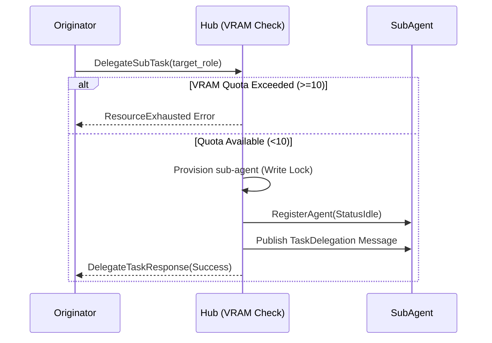

# Design Doc: Hierarchical Task Delegation (Delegate SubTask)

**Author(s):** TPM Agent
**Status:** Approved
**Last Updated:** 2026-03-27

## 1. Overview
Hierarchical Task Delegation allows agents to provision temporary, specialized sub-agents dynamically to tackle specific, complex sub-tasks, under strict VRAM quota limits. This mechanism ensures efficient resource allocation and distinct context isolation across agent threads.

## 2. Goals & Non-Goals
### 2.1 Goals
- Enable an agent to spawn a specialized sub-agent for executing a distinct task.
- Enforce strict VRAM resource quotas (a hard limit of 10 active agents per hub).
- Isolate the sub-agent instructions and execution thread context from the originating caller.

### 2.2 Non-Goals
- Complex inter-agent negotiations during sub-task execution.
- Persistence of dynamic `sub-agent` state across complete system restarts (they are temporary).

## 3. Implementation Details

> **Developer Insight:**
> *When dynamically spawning agents, hold the `Write Lock` during quota enforcement and registry updates to prevent Time-of-Check to Time-of-Use (TOCTOU) concurrency bugs.*

- **Architecture**: A new RPC method `DelegateSubTask(ctx context.Context, req *pb.SubTask)` is implemented in the `HubServiceServer`.
- **Quota Enforcement**: A write lock checks the current number of registered agents to prevent TOCTOU bypasses. If the count exceeds or is equal to 10, a `ResourceExhausted` gRPC status is returned.
- **Provisioning**: The system dynamically creates an `Agent` struct using the `target_role`. It is assigned to the `dynamic-delegation` organization and registered directly into the `Hub`'s internal map, avoiding race conditions.
- **Sender Validation**: To ensure proper publishing and prevent "sender agent is not registered" errors during message passing, the `FromAgentId` is verified to exist in the `Hub`'s registry prior to publishing.
- **Routing**: An initial task message containing the instruction and parent thread ID is published from the originating agent directly to the `sub-agent`.

## 4. Edge Cases
- **Missing Arguments**: If the `task_id` or `target_role` are empty strings, an `InvalidArgument` error is immediately returned.
- **VRAM Quota Exceeded**: If total agents are >= 10, the system proactively blocks the sub-agent's creation and returns an error without publishing any tasks.

