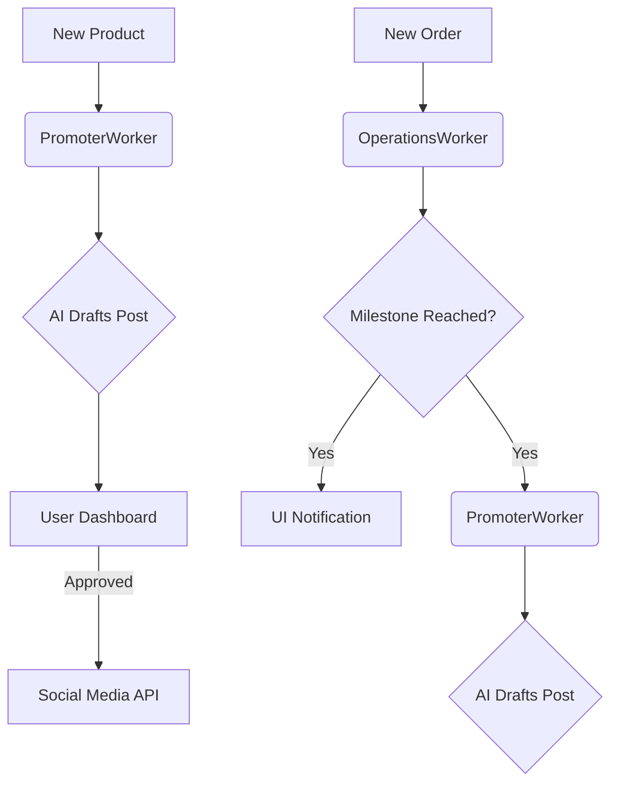

# OHC Growth Engine Design Specification

## Overview
The OHC Growth Engine is designed to facilitate rapid business acquisition and success for small business owners. It implements viral loops, social media automation, and email marketing tightly integrated with AI agents.

## Core Components

### 1. Referral Program
- **Mechanism**: "Share OHC with a friend, both get 1 month free Pro."
- **Tracking**: unique referral codes tied to tenant IDs.
- **Rewards**: Credit attribution system increases AI action quotas upon successful conversion.

### 2. Social Media AI Agent (The Promoter)
- **Auto-Posting**: Automatically drafts posts for:
  - New product creation.
  - Significant sales milestones.
  - Periodic business newsletters.
- **Approval Workflow**: Business owners approve or edit drafts from their mobile dashboard with one tap.

### 3. Email Marketing
- **Campaigns**: Built-in tool for AI-generated email templates.
- **Analytics**: Tracks open rates and click counts for business insights.
- **Worker**: `EmailCampaignWorker` handles scheduled distribution and AI content refinement.

### 4. Viral Storefront
- **"Built with OHC"**: Subtle footer in every storefront link creates a natural acquisition funnel.
- **OpenGraph Cards**: Beautifully designed link previews for Instagram, X, and WhatsApp.

### 5. Success Milestones
- **Notifications**: Celebration of business wins (1st sale, 10th order, etc.).
- **Impact**: Encourages user retention and advocacy.

## Quota & Tier System
| Tier | Base Monthly Actions | Referral Bonus |
|------|----------------------|----------------|
| Free | 50                   | +50 / referral |
| Starter | 100               | +50 / referral |
| Pro | 1000                  | +50 / referral |
| Business | 10000            | +50 / referral |

## Architectural Flow

