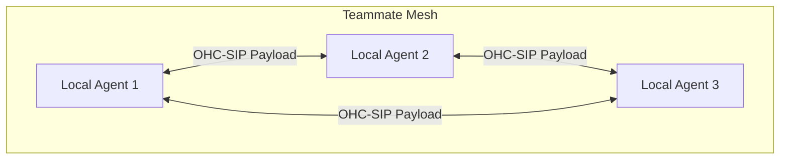
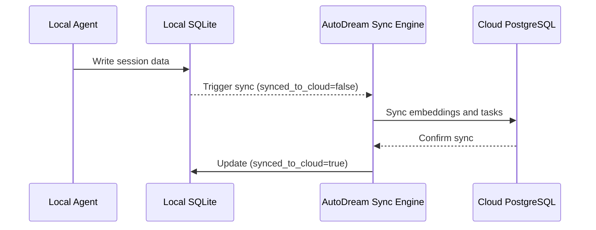

# Hybrid Agentic OS Architecture

The One Human Corp (OHC) platform is built on a **Hybrid Agentic OS Architecture**. This design allows the platform to operate seamlessly across two distinct environments: a horizontally scalable Cloud-Native Mode and a robust, localized Standalone Desktop Mode.

## Core Concepts

The architecture ensures that the core AI agent logic, task orchestration, and data consistency remain unified regardless of where the application is running.

### Cloud-Native Mode

In **Cloud-Native Mode**, OHC leverages a multi-tenant Kubernetes deployment. This environment is designed for high availability and maximum throughput, handling orchestration for thousands of concurrent users. It uses PostgreSQL for primary data storage, Redis for distributed locking (`rueidis`), and distributed task queues to manage complex AI agent workflows via the KAIROS Orchestrator.

### Standalone Desktop Mode

The **Standalone Desktop Mode** brings the full power of the OHC platform to an individual's machine. To achieve this without relying on heavy centralized infrastructure, the system gracefully degrades its dependencies:
- **Database**: Falls back from PostgreSQL to local **SQLite**. Features like PostgreSQL JSONB degrade to TEXT, and pgvector embeddings degrade to standard BLOB storage.
- **Distributed Locks**: The `DistributedLockProvider` switches from Redis-backed locks to the `SQLiteMutexProvider`, utilizing a local `distributed_locks` table to ensure cross-process safety locally.
- **Task Queues**: The distributed `TaskQueue` gracefully shifts to a local polling mechanism against SQLite tables to manage isolated sub-agent execution.

### The Teammate Mesh

The **Teammate Mesh** provides real-time, peer-to-peer collaboration and synchronization for agents, even in Standalone Mode. It allows local agents to communicate, share state, and broadcast updates without a central server intermediary. The mesh relies on strict payload validation defined by the `MeshMessage` struct (`agent_id`, `action`, `status`) to comply with the OHC-SIP specification.

### AutoDream Sync Engine

To maintain long-term coherence across hybrid deployments, the **AutoDream Sync Engine** seamlessly synchronizes local agent memories and states with the cloud.

When a local session ends or requires compression, the AutoDream consolidation logic writes the data to a local vector store. The Sync Engine monitors tables like `embedding_cache` and `agent_missions` for records marked `synced_to_cloud = false` and synchronizes them to the cloud's pgvector index.

## Seamless Transitions

The beauty of the Hybrid Architecture lies in its seamless transitions. The deployment mode is dynamically determined by the `OHC_STANDALONE` environment variable (`true` for Standalone, otherwise Cloud-Native). This single toggle automatically re-routes file operations (via the Hybrid File System MCP Server), degrades databases, and adjusts lock mechanisms, ensuring an uninterrupted user experience whether online or offline.

