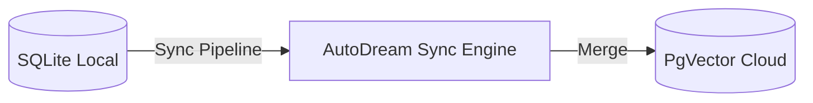

# Hybrid Architecture: The Best of Both Worlds

The One Human Corp (OHC) Agentic OS utilizes a unique **Hybrid Architecture (OHC-HA)**, seamlessly transitioning between high-scale cloud deployments and secure, localized execution.

## 1. Operating Modes

### Cloud-Native Mode
- **Target:** Enterprise organizations requiring horizontal scale.
- **Backend:** PostgreSQL (with `pgvector`), Redis for Pub/Sub, Kubernetes orchestration.
- **Benefits:** Strict multi-tenant isolation, massive parallelism, and high concurrency.

### Standalone Desktop Mode
- **Target:** Individuals or air-gapped environments requiring ultimate privacy.
- **Backend:** SQLite (with fallback BLOB storage for vectors), Local In-Memory Channels.
- **Benefits:** Zero external dependencies, low resource consumption, works completely offline.

## 2. Core Sync Mechanisms

To bridge the gap between these modes, OHC implements two crucial technologies:

### AutoDream Sync Engine
When operating locally, agents generate "memories" and insights. Upon reconnecting to the cloud, the `AutoDreamWorker` synchronizes these local insights (stored in SQLite) directly into the Cloud Postgres instance.

### Teammate Mesh
Real-time coordination is essential.
- In the **Cloud**, we utilize Redis Pub/Sub (`mesh:tasks`).
- In **Standalone Mode**, we fall back to a high-performance, in-memory mutex-backed messaging system.

## 3. Visual Excellence Mandate
All interfaces interacting with the Hybrid Architecture adhere to strict premium Glassmorphism design tokens to guarantee user delight across all platforms.

