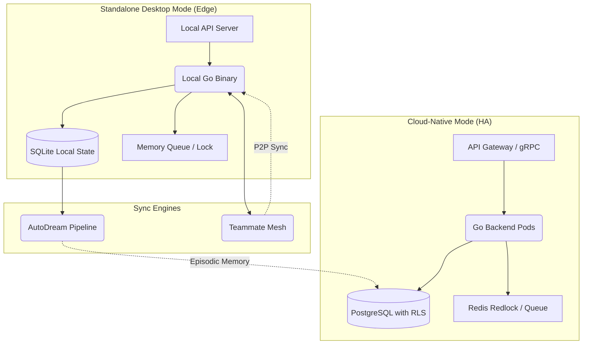
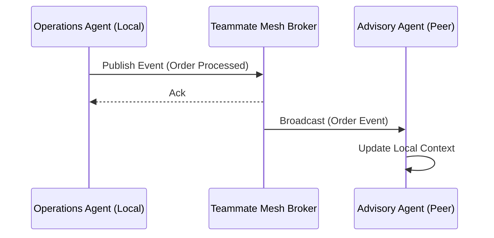
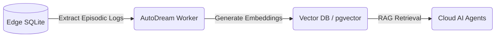

# OHC Hybrid Architecture

  <h2>The "Hybrid Agentic OS" Mandate</h2>
  
The OneHumanCorp (OHC) platform is designed as a seamlessly unified <b>Hybrid Agentic OS</b>. It uniquely bridges the power of Cloud-Native multi-tenant availability with the resilience of Edge-first, zero-infrastructure deployment.

The architecture supports two primary operational modes:

1. **Cloud-Native Mode:** The default operational mode for multi-tenant SaaS environments, powered by Kubernetes, PostgreSQL, and Redis.
2. **Standalone Desktop Mode:** A zero-infrastructure fallback designed for local autonomy, leveraging SQLite and the Teammate Mesh.

## Architecture Overview

## Standalone Desktop Mode

When operating in environments with intermittent connectivity or where strict local autonomy is required, the system gracefully degrades to **Standalone Desktop Mode**.

### Key Components

- **SQLite Fallback**: In the absence of a managed PostgreSQL instance, the application utilizes SQLite as a robust local data store, maintaining schema compatibility where possible (e.g., using `VARCHAR` for UUIDs).
- **In-Memory Coordinators**: Replaces Redis-backed Distributed Locks and Queues with fast, local in-memory alternatives, preserving agent functionality without external dependencies.

## Teammate Mesh

The **Teammate Mesh** provides the essential communication fabric for distributed agents operating at the Edge.

- **Peer-to-Peer Synchronization**: Enables real-time event distribution and state synchronization across multiple local agents without routing through the central cloud.
- **Resilient Delivery**: Ensures messages are delivered even in unstable network conditions.

## AutoDream Data Pipeline

The **AutoDream Data Pipeline** is responsible for consolidating edge telemetry and episodic memory back into long-term cloud storage.

- **Episodic Memory**: Collects completed tasks, session logs, and agent interactions stored locally in SQLite.
- **Consolidation**: Asynchronously transmits and translates episodic data into vector embeddings within the Cloud's `autodream_memories` table (using PostgreSQL's `pgvector` with `hnsw` indexes).
- **RAG Enablement**: Empowers cloud-based AI agents with deep contextual awareness of edge operations.

  
<i>The Hybrid Architecture ensures OHC remains resilient, scalable, and ever-present, regardless of the deployment environment.</i>

