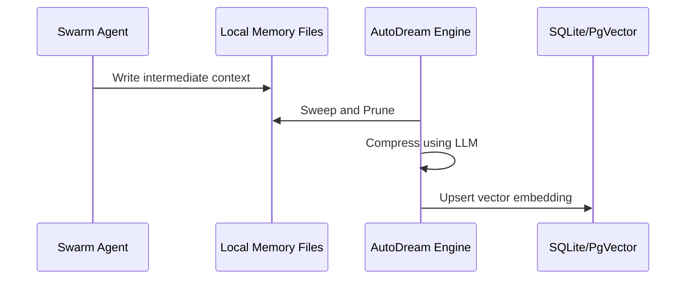

<div markdown="1" style="backdrop-filter: blur(20px) saturate(200%); font-family: 'Outfit', 'Inter', sans-serif; border: 1px solid rgba(255, 255, 255, 0.1); padding: 20px; border-radius: 12px; background: rgba(255, 255, 255, 0.05); color: #fff;">

# The Hybrid Architecture Playbook

One Human Corp (OHC) is built on a foundational **Hybrid Architecture (OHC-HA)** designed to provide absolute autonomy, whether you are operating on a completely offline, air-gapped laptop or a massively scalable cloud cluster.

## The Dual Modes

### 1. Standalone Desktop Mode (Local)
- **Purpose**: Low resource consumption, absolute data privacy, offline capabilities.
- **Database**: Uses local **SQLite**. Perfect for single-user contexts and episodic memory storage.
- **Messaging**: Degrades gracefully to in-memory Go channels instead of requiring complex external messaging brokers.
- **Vector Search**: Performs exact nearest-neighbor search directly in-memory or via simple disk fallback if `pgvector` is absent.

### 2. Cloud-Native Mode (Distributed)
- **Purpose**: Multi-tenant orchestration, vertical scaling, high-concurrency pod operations.
- **Database**: Uses **PostgreSQL** with robust row-level locking (`FOR UPDATE SKIP LOCKED`) to ensure horizontal worker pods do not collide when claiming tasks from the Shared Task List.
- **Messaging**: Leverages **Redis Pub/Sub** (via `rueidis`) and `CentrifugeNode` to establish a low-latency **Teammate Mesh**.
- **Vector Search**: Embeds memories into `swarm_memory_embeddings` utilizing the `pgvector` extension for sub-millisecond semantic retrieval across millions of tokens.

---

## Core Engines

### The Teammate Mesh
The Teammate Mesh is the nervous system of the swarm.

```mermaid
graph LR
    A[Agent A] -->|Publish Event| Mesh{Teammate Mesh}
    Mesh -->|Filter & Route| B[Agent B]
    Mesh -->|Filter & Route| Dashboard[UI Dashboard]

    classDef premium fill:rgba(255,255,255,0.03),stroke:rgba(255,255,255,0.08),stroke-width:1px,color:#fff,backdrop-filter:blur(20px) saturate(200%);
    class A,Mesh,B,Dashboard premium;
```

In Cloud Mode, this uses Redis. In Standalone Mode, it transparently uses an internal dispatcher.

### The AutoDream Sync Engine
AutoDream serves as the long-term memory consolidator. It prevents context window bloat by continually compressing intermediate agent artifacts into vector embeddings.



## Syncing State
The true power of the Hybrid Architecture is the **Hybrid Local-to-Cloud State Sync MCP Proxy**. This allows an agent operating in Standalone Mode to escalate complex workloads to the Cloud-Native Postgres orchestration engine when massive parallel computation is required, completely abstracting the transition from the user.

</div>
