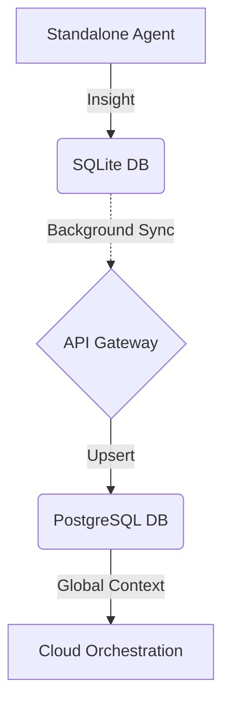

# Hybrid MCP RAG Protocol: Bridging Standalone to Cloud

## 1. Overview
The Hybrid MCP RAG Protocol allows One Human Corp (OHC) agents to seamlessly bridge the gap between local, private execution in Standalone Mode (SQLite) and highly scalable orchestration in Cloud-Native Mode (PostgreSQL).

## 2. Architecture
The architecture utilizes a background Sync Daemon running in Standalone Mode to continuously merge episodic vector memories to the multi-tenant PostgreSQL orchestration engine.

## 3. Data Synchronization
Memories are processed with a `sync_status` to ensure reliable Last-Write-Wins (LWW) conflict resolution between the local device and the K8s cloud.

