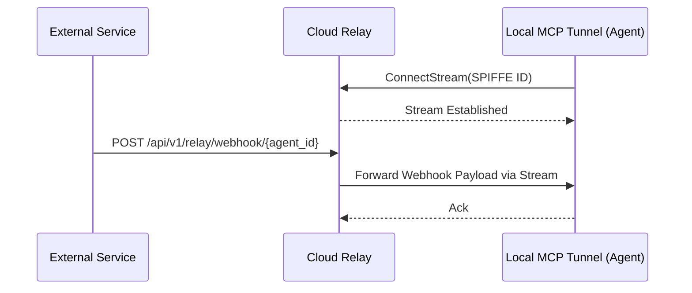

<div markdown="1" style="backdrop-filter: blur(20px) saturate(200%); font-family: Outfit, Inter, sans-serif; border: 1px solid rgba(255, 255, 255, 0.1); padding: 20px; border-radius: 12px; background: rgba(255, 255, 255, 0.05);">

# Design Doc: Hybrid MCP Tool for Secure Local Webhook Forwarding

**Author(s):** Lens
**Status:** Draft
**Last Updated:** 2024-04-22

## 1. Overview
OHC's Hybrid Agentic OS requires the ability for standalone agents (running in local SQLite mode) to receive asynchronous webhooks from external services. Local environments lack a publicly accessible endpoint, preventing external services from pushing events. This feature introduces an MCP tool that establishes an encrypted, bidirectional multiplexed connection from the local standalone agent to a centralized OHC Cloud relay, allowing secure webhook delivery to local environments.

## 2. Goals & Non-Goals
### 2.1 Goals
- Allow local standalone agents to securely receive external webhooks without opening local ports to the internet.
- Implement a Cloud Relay service to receive webhooks and forward them over a persistent stream to connected local agents.
- Implement a Local Tunnel MCP tool that connects to the Relay and injects received payloads into the local event bus.
- Rely entirely on SPIFFE/SPIRE for identity and authentication.

### 2.2 Non-Goals
- Full Ngrok-like public URL generation for arbitrary HTTP traffic (restricted to webhook JSON payloads).
- Handling webhook retries at the Relay level (to be handled by external providers).

## 3. Detailed Design
### 3.1 Architecture Diagram


### 3.2 Data Model & Schema
#### Memory Models
```rust
struct WebhookPayload {
    agent_id: String,
    headers: std::collections::HashMap<String, String>,
    body: Vec<u8>,
}
```

### 3.3 API Design
#### REST Endpoints
- `POST /api/v1/relay/webhook/{agent_id}`: Accepts incoming webhooks, locates the active stream for `{agent_id}`, and forwards the payload.

### 3.4 Logic & Algorithms
- The Local Agent initiates a persistent outbound stream, such as a gRPC or WebSocket stream, to the Cloud Relay.
- The Cloud Relay maintains a map of `AgentID` -> `Stream connection`.
- Upon receiving a webhook, the Cloud Relay checks if the `AgentID` is connected. If yes, it forwards the payload. If not, it drops it or returns 404/503.

## 4. Cross-cutting Concerns
### 4.1 Security & Identity
- Connections from the Local Tunnel to the Cloud Relay authenticate using SPIFFE SVIDs.
### 4.2 Scalability & Performance
- The Relay uses sync.Map or similar to track active connections.
### 4.3 Monitoring & Observability
- Export metrics for connected agents and forwarded webhooks using OpenTelemetry.

## 5. Alternatives Considered
- **Ngrok/Cloudflare Tunnels**: Rejected due to external dependencies and violation of Zero Secrets architecture.

## 6. Implementation Plan
1. Implement the Cloud Relay service in Rust alongside the existing Axum/tonic server surface.
2. Implement Local Tunnel MCP tool.
3. Provide E2E tests verifying the end-to-end flow.

</div>
