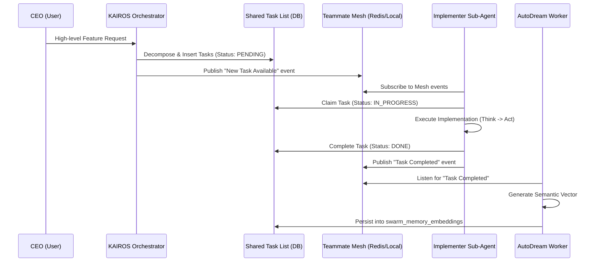

# Design Doc: KAIROS Orchestration Implementation

**Author(s):** Antigravity, Principal Product Architect
**Status:** Approved
**Last Updated:** 2026-04-03

## 1. Overview
The KAIROS Orchestration Implementation details the architectural foundation for the OHC Swarm. It introduces the Shared Task List, Teammate Mesh APIs, and AutoDream Vector Pipelines to enable asynchronous orchestration and scalable background task processing.

## 2. Shared Task List (Database Design)
The Shared Task List tracks high-level feature requests decomposed into a shared task queue for the agent team.
*   **Table:** `orchestration_tasks`
*   **Columns:** `id` (UUID/TEXT), `title` (TEXT), `description` (TEXT), `status` (VARCHAR - PENDING, IN_PROGRESS, DONE, BLOCKED), `assigned_agent` (VARCHAR), `created_at` (TIMESTAMP), `updated_at` (TIMESTAMP).
*   **Constraint:** Must support both PostgreSQL (Cloud-Native) and SQLite (Standalone).

## 3. Teammate Mesh API (Realtime Mesh)
The Teammate Mesh facilitates communication between isolated sub-agents and the KAIROS Orchestrator.
*   **Interface:** `PublishTeammateMesh(channel string, payload []byte)` and `SubscribeTeammateMesh(channel string) (<-chan []byte, error)`.
*   **Cloud-Native Mode:** Backed by Redis Pub/Sub (`go-redis`).
*   **Standalone Mode:** Backed by local Go channels (`sync.Cond` or simple `chan` multiplexing) when Redis is unavailable.

## 4. AutoDream Vector Pipelines
The AutoDream pipeline is a durable state worker that periodically consolidates Teammate Mesh logs and meeting room transcripts into long-term vector storage for future semantic retrieval.
*   **Worker:** A background goroutine spawned during `Server` initialization.
*   **Embeddings API:** Interacts with the LLM API to generate vector representations of task completions.
*   **Storage:** Saves vectors into a `pgvector` compatible schema (e.g., `swarm_memory_embeddings`).

## 5. Sequence Diagram

## 6. Execution Playbook Tracking
*   Phase 1 (UltraPlan/Decomposition): Define DB schema and Sequence Diagram. [COMPLETE]
*   Phase 2 (Orchestration): Design Teammate Mesh APIs. [COMPLETE]
*   Phase 3 (autoDream): Architect AutoDream data pipelines. [COMPLETE]
*   Phase 4 (Finalize): Submit Design Doc via PR. [IN PROGRESS]
