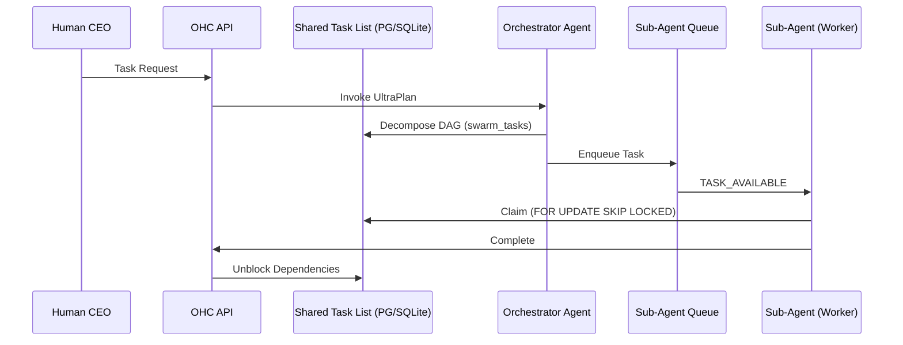

<div markdown="1" style="backdrop-filter: blur(20px) saturate(200%); font-family: 'Outfit', 'Inter', sans-serif; border: 1px solid rgba(255, 255, 255, 0.1); padding: 20px; border-radius: 12px; background: rgba(255, 255, 255, 0.03);">

# Design Doc: KAIROS Orchestration & Hybrid AI OS
**Author:** Principal Product Architect & KAIROS Orchestrator (L7)

## 1. Overview
KAIROS Orchestration is the autonomous backbone of the OHC Hybrid Agentic OS, driving Shared Task Lists, Teammate Mesh, Sub-Agent Queues, Distributed State Machines, and AutoDream pipelines across both Cloud (PostgreSQL/Redis) and Standalone (SQLite) modes.

## 2. Phase 1: Shared Task List & DAG Dependencies
**Database Schema:**
```sql
CREATE TABLE IF NOT EXISTS swarm_tasks (
    id UUID PRIMARY KEY DEFAULT gen_random_uuid(),
    mission_id TEXT NOT NULL,
    parent_plan_id TEXT,
    dependencies JSONB NOT NULL DEFAULT '[]',
    title TEXT NOT NULL,
    status TEXT NOT NULL DEFAULT 'PENDING',
    assigned_agent_id TEXT,
    payload JSONB,
    locked_until TIMESTAMPTZ,
    created_at TIMESTAMPTZ DEFAULT CURRENT_TIMESTAMP
);

CREATE TABLE IF NOT EXISTS state_machine_transitions (
    id TEXT PRIMARY KEY,
    entity_id TEXT NOT NULL,
    entity_type TEXT NOT NULL,
    from_state TEXT NOT NULL,
    to_state TEXT NOT NULL,
    agent_id TEXT,
    reason TEXT,
    occurred_at TIMESTAMPTZ DEFAULT CURRENT_TIMESTAMP
);
CREATE INDEX idx_sm_entity ON state_machine_transitions(entity_id, entity_type);
```

**Sequence Diagram:**


## 3. Phase 2: Teammate Mesh APIs
Realtime Transport via `MeshTransport` interface (`RedisMeshTransport` and `MemoryMeshTransport`). Agents interact via gRPC (`srcs/proto/hub.proto`):
* `AdvertiseCapabilities(AgentCapabilities)`
* `DiscoverAgents(Query)`
* `StreamMeshEvents(EventStreamRequest)`

## 4. Phase 3: AutoDream Pipeline
Worker consumes `.agent-task/memory/*.yml`. Embeddings stored in `pgvector`:
```sql
CREATE TABLE IF NOT EXISTS consolidated_memory (
    id TEXT PRIMARY KEY,
    organization_id TEXT NOT NULL,
    agent_id TEXT,
    content TEXT NOT NULL,
    embedding vector(1536),
    source_type TEXT NOT NULL,
    created_at TIMESTAMPTZ DEFAULT CURRENT_TIMESTAMP
);
CREATE INDEX ON consolidated_memory USING hnsw (embedding vector_l2_ops);
```

</div>
