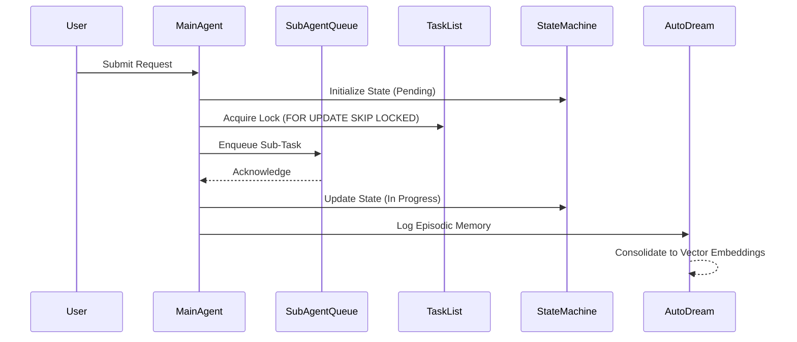

<div markdown="1" style="backdrop-filter: blur(20px) saturate(200%); font-family: 'Outfit', 'Inter', sans-serif; background: rgba(255, 255, 255, 0.03); color: #fff; padding: 20px; border-radius: 12px; border: 1px solid rgba(255, 255, 255, 0.1);">

# KAIROS Orchestration Architecture Overview

<div class="ohc-premium-header">
  <h1>KAIROS Orchestrator</h1>
  <p>The centralized brain for OneHumanCorp's AI agent swarm.</p>
</div>

<div class="ohc-premium-card">
  <h2>Executive Summary</h2>
  <p>The KAIROS Orchestrator is the core engine that manages the lifecycle, coordination, and state of all AI agents within the OneHumanCorp platform. It ensures seamless handoffs, shared context, and reliable execution across Cloud and Standalone environments.</p>
</div>

## Component Breakdown

KAIROS consists of five primary components working in tandem to facilitate complex workflows:

1.  **Shared Task List:** The source of truth for all pending and active tasks.
2.  **Teammate Mesh:** The communication backbone enabling agents to broadcast presence, request help, and share context.
3.  **AutoDream Pipeline:** The memory consolidation engine that converts episodic task logs into long-term vector embeddings.
4.  **Sub-Agent Queue:** The asynchronous execution queue for delegating sub-tasks to specialized agents.
5.  **State Machine:** The distributed state tracker ensuring tasks progress reliably through defined states.



## Database Schema Definitions

KAIROS utilizes a hybrid database approach, supporting both PostgreSQL (Cloud) and SQLite (Standalone).

### `ohc_tasks` (Shared Task List & State Machine)

```sql
CREATE TABLE ohc_tasks (
    id VARCHAR PRIMARY KEY, -- Manual UUID generation for SQLite compatibility
    tenant_id VARCHAR NOT NULL,
    status VARCHAR NOT NULL, -- PENDING, IN_PROGRESS, COMPLETED, FAILED
    payload JSONB,
    assigned_agent_id VARCHAR,
    created_at TIMESTAMP DEFAULT CURRENT_TIMESTAMP,
    updated_at TIMESTAMP DEFAULT CURRENT_TIMESTAMP
);

-- PostgreSQL only: Row Level Security
-- ALTER TABLE ohc_tasks ENABLE ROW LEVEL SECURITY;
```

### `ohc_memory_embeddings` (AutoDream Pipeline)

```sql
CREATE TABLE ohc_memory_embeddings (
    id VARCHAR PRIMARY KEY,
    tenant_id VARCHAR NOT NULL,
    task_id VARCHAR NOT NULL,
    content TEXT NOT NULL,
    -- PostgreSQL: VECTOR(1536)
    -- SQLite Fallback: BLOB
    embedding VECTOR(1536),
    created_at TIMESTAMP DEFAULT CURRENT_TIMESTAMP
);
```

## API Interfaces

### Teammate Mesh APIs (Pub/Sub)

The Teammate Mesh provides real-time communication capabilities via Redis Pub/Sub (Cloud) or Memory Channels (Standalone).

```go
type MeshTransport interface {
    Publish(channel string, payload []byte) error
    Subscribe(channel string, handler func(payload []byte)) error
    BroadcastPresence(agentID string, status string) error
}
```

### Sub-Agent Queue

The Sub-Agent Queue manages asynchronous delegation, utilizing Redis Streams or a DB-backed queue.

```go
type SubAgentQueue interface {
    Enqueue(taskID string, payload []byte) error
    Dequeue(agentID string) (*Task, error)
    Acknowledge(taskID string) error
    Retry(taskID string, attempt int) error
}
```

</div>
