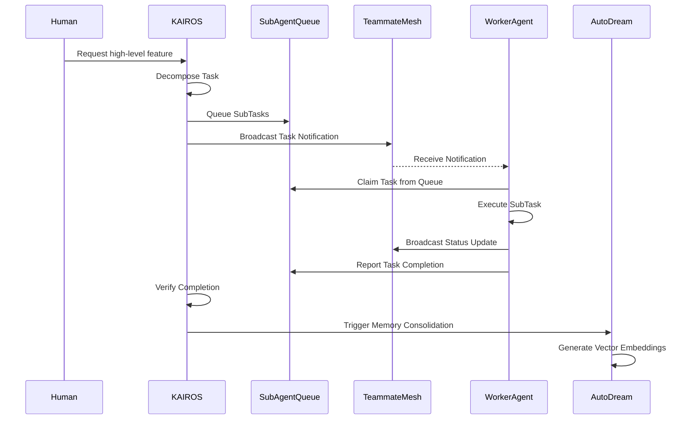

<h1 class="ohc-premium-header">KAIROS Orchestration: Architecture Overview</h1>

## 1. Executive Summary
The KAIROS Orchestrator serves as the core intelligence engine of the OHC Swarm. Its responsibility is to translate high-level human directives into structured, executable tasks. KAIROS operates natively across both Cloud-Native Kubernetes clusters (via PostgreSQL, Redis) and Standalone Desktop deployments (via SQLite, in-memory structures), ensuring continuous autonomy and maximum efficiency without deadlocks.

## 2. Component Breakdown

| Component | Cloud Mode | Standalone Desktop Mode | Purpose |
|-----------|------------|-------------------------|---------|
| **Shared Task List** | PostgreSQL (`SELECT FOR UPDATE SKIP LOCKED` / `NOW()`) | SQLite (`sync.Mutex` / `datetime('now')`) | Durable tracking of swarm tasks and dependency management. |
| **Teammate Mesh** | Redis Pub/Sub | In-memory local bus | Realtime coordination, Pub/Sub messaging, and lock management. |
| **AutoDream Pipeline** | `pgvector` | Native SQLite fallback | Asynchronous memory consolidation to preserve episodic context. |
| **Sub-Agent Queue** | Redis Streams | DB-based atomic updates | Managing sub-task distribution and tracking execution state. |
| **State Machine** | DB Transactions | DB Transactions | Orchestrating task lifecycles securely. |

### 2.1 Database Schema
- **Tasks Table**: `id`, `title`, `description`, `status`, `assigned_agent`, `created_at`, `updated_at`. Also modeling directed acyclic graph (DAG) via shared tasks and dependencies.
- **AutoDream Embeddings**: Storing `[]byte` vector embeddings.

### 2.2 API Interfaces
- **TeammateMesh:** Pub/Sub, Presence, Locks (e.g. `mesh:tasks`, `mesh:coordination`).
- **SubAgentQueue:** Managing Sub-Agent Queues.

## 3. Swarm Coordination

