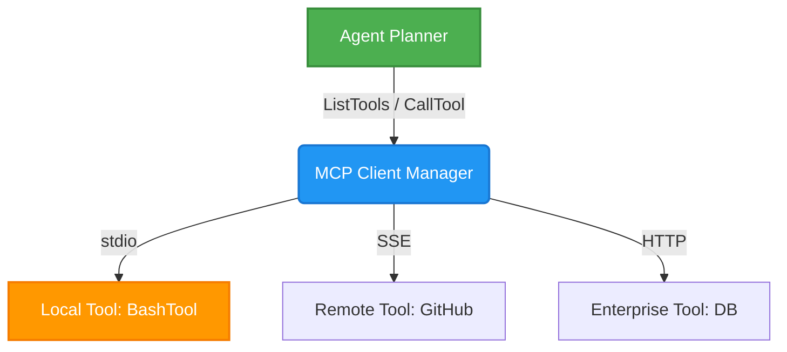

# OHC Agent Harness: Market Research & Architecture Evolution

  <h2 style="font-family: 'Inter', sans-serif; font-weight: 600;">Executive Summary</h2>
  
In our mission to build the world's most autonomous and aesthetically superior Agentic Operating System, we conducted a deep-dive analysis into the agent harness architecture of Claude Code (v2.1.88). The findings reveal two major architectural gaps in OHC-HA: semantic Bash execution sandboxing and native Model Context Protocol (MCP) tool integration.

## Architectural Deep Dive: Claude Code (v2.1.88)

### 1. The MCP-Driven Harness
Claude Code relies entirely on the Model Context Protocol (MCP) as its core integration layer. The agent harness itself runs as an MCP server (`src/entrypoints/mcp.ts`), exposing its capabilities while dynamically loading external MCP servers (stdio, HTTP, SSE) via a `.mcp.json` scope configuration.

### 2. Semantic Bash Sandboxing
Unlike primitive terminal wrappers, Claude Code employs a deeply integrated `BashTool` that performs semantic analysis of commands prior to execution.

Key security mechanics observed in `src/tools/BashTool/bashSecurity.ts`:
- **Pre-execution AST Analysis:** Blocks >20 dangerous patterns including `zmodload`, process substitution `>()`, `$[]` legacy expansions, and obfuscated variables.
- **Semantic Understanding:** Functions like `isSearchOrReadBashCommand` classify the intent of pipelines to adjust UI presentation and safety guardrails.
- **Filesystem & Network Isolation:** Wraps execution using `@anthropic-ai/sandbox-runtime` (`sandbox-adapter.ts`), imposing dynamic read/write boundary restrictions and `allowedHosts` network constraints.

## OHC-HA vs. Market Leader (Claude Code)

| Capability | OHC-HA (Current) | Claude Code (v2.1.88) | Gap Resolution |
| :--- | :--- | :--- | :--- |
| **Tool Integration** | Bespoke / Custom Interfaces | Native MCP (Model Context Protocol) | Implement `srcs/server/harness/mcp/` manager |
| **Bash Execution** | Basic Shell Wrappers | Semantic AST Parsing & Validations | Implement `srcs/server/harness/bash_sandbox/` |
| **Sandbox Isolation** | OS-level generic boundaries | Strict FS/Network per-command rules | Integrate scoped sandbox policies |
| **Extensibility** | Manual Tool Porting | Zero-friction `.mcp.json` imports | Expose OHC internal tools as MCP schemas |

  Market Action: Immediate implementation of GitHub Missions #4910 & #4911 required to achieve parity.

