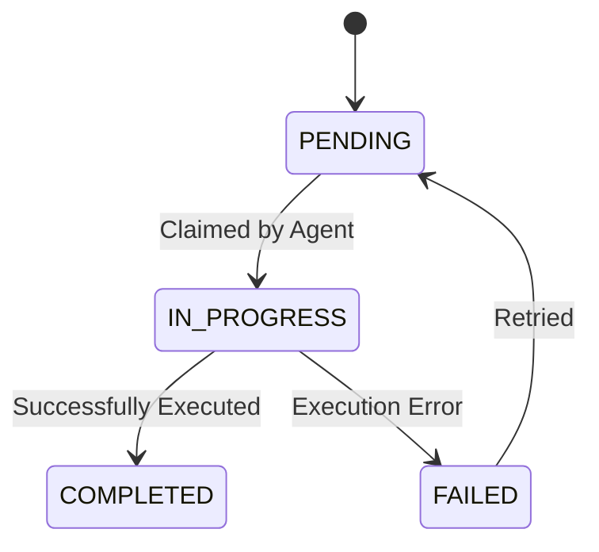

# KAIROS Distributed State Machine

The KAIROS Distributed State Machine governs the lifecycle of tasks across the swarm, ensuring hybrid consistency.

## State Transitions

## Details
- Utilizes `FOR UPDATE SKIP LOCKED` on PostgreSQL.
- Falls back to application mutexes on SQLite.

