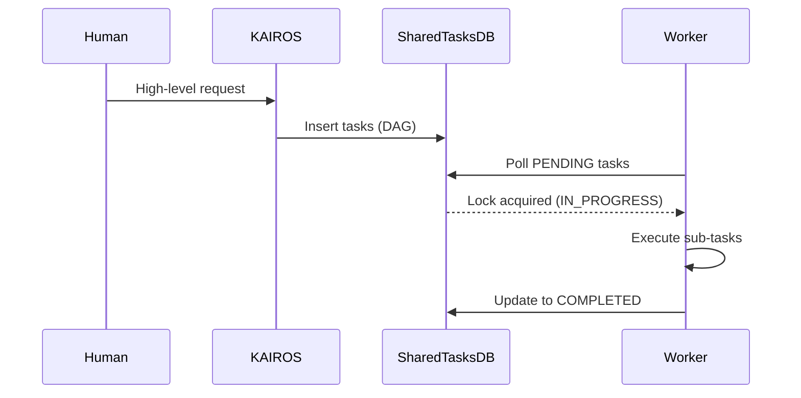

# Hybrid AI OS Implementation Guide (KAIROS)

## Phase 1: Shared Task List Database Design & Sequence
**Database Design:**
The `shared_tasks` table stores high-level features decomposed into tasks, and `task_dependencies` tracks the DAG.
We use a robust distributed State Machine tracker in `state_machine_transitions` with `FOR UPDATE SKIP LOCKED` in Cloud mode (PostgreSQL) and mutexed table locks in Standalone (SQLite).

## Phase 2: Realtime Teammate Mesh APIs
**Design:**
The Teammate Mesh enables real-time Pub/Sub between isolated agent pods.
- **Channels:** `mesh:tasks`, `mesh:coordination`, `mesh:ultraplan`
- **APIs:**
  - `PublishTaskBroadcast(taskID, payload)`
  - `SubscribeCoordination(agentID)`
- **Transport:** Switches between Redis (Cloud) and in-memory local bus (Standalone).

## Phase 3: AutoDream Data Pipelines
**Design:**
AutoDream converts transient agent context into durable vector embeddings for long-term memory.
- **Pipeline:** Sweeps `.agent-task/memory/` and `agent_session_data`.
- **Embeddings:** Integrates with LLM API (Gemini/Anthropic) to produce `VECTOR(1536)`.
- **Storage:** Persisted into `autodream_memories` (pgvector in Postgres) for semantic KNN search.

