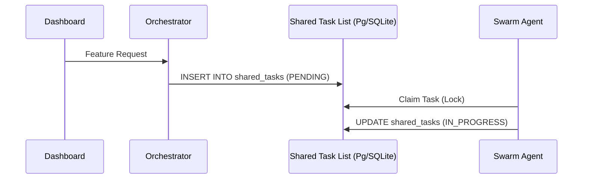

# KAIROS Orchestration: Unified Hybrid AI OS Architecture

## Phase 1: Shared Task List (Task Decomposition)
The Shared Task List serves as the brain of the OHC Swarm.
- **Database:** PostgreSQL (`FOR UPDATE SKIP LOCKED`) for Cloud, SQLite (Mutex) for Standalone.
- **Schema:** Tracks state via `shared_tasks` and `state_machine_transitions`.

## Phase 2: Teammate Mesh APIs (Orchestration)
The Teammate Mesh provides real-time event broadcasting and zero-friction coordination across pods.
- **Channels:** `mesh:tasks`, `mesh:coordination`.
- **Transport:** Redis Pub/Sub (Cloud), Memory Transport (Standalone).

## Phase 3: AutoDream Data Pipeline (Memory)
Continuous long-term memory vectorization.
- **Mechanism:** Parses ephemeral YAML files in `.agent-task/memory/` to chunked embeddings via Minimax.
- **Storage:** Upserts to `consolidated_memory` using `pgvector`.

