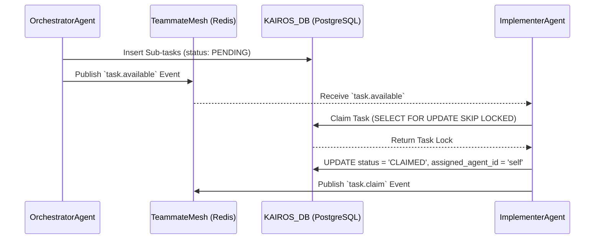
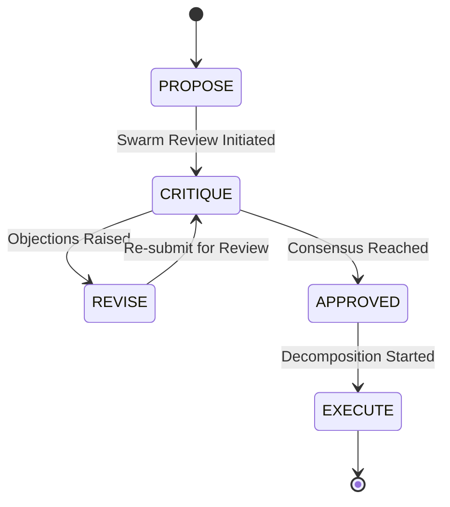

<div markdown="1" style="backdrop-filter: blur(20px) saturate(200%); font-family: 'Outfit', 'Inter', sans-serif; border: 1px solid rgba(255, 255, 255, 0.1); padding: 20px; border-radius: 12px; background: rgba(255, 255, 255, 0.05); color: #fff;">

# OHC KAIROS Hybrid AI OS Implementation Design Doc

**Author:** Principal Product Architect & KAIROS Orchestrator (L7)
**Status:** Approved
**Version:** 1.0.0

## 1. Overview
The KAIROS Orchestrator serves as the core orchestration engine powering the One Human Corp (OHC) Swarm. This document outlines the implementation strategy for the structural and aesthetic vision of the OHC Hybrid Agentic OS, specifically covering Task Decomposition, UltraPlan Deliberation, State Machine Tracking, Sub-Agent Orchestration, Teammate Mesh Architecture, and AutoDream Data Pipelines.

## 2. Phase 1: Shared Task List (Task Decomposition)
A durable, distributed state machine and task queue designed for both Cloud-Native and Standalone Desktop environments.

### 2.1 Database Schema (Hybrid SQLite/PostgreSQL)
```sql
CREATE TABLE IF NOT EXISTS shared_tasks (
    id UUID PRIMARY KEY DEFAULT gen_random_uuid(),
    epic_id UUID REFERENCES epics(id),
    title TEXT NOT NULL,
    description TEXT,
    status VARCHAR(50) NOT NULL DEFAULT 'PENDING',
    assigned_agent_id VARCHAR(255),
    dependencies JSONB DEFAULT '[]',
    created_at TIMESTAMP WITH TIME ZONE DEFAULT CURRENT_TIMESTAMP,
    updated_at TIMESTAMP WITH TIME ZONE DEFAULT CURRENT_TIMESTAMP
);

CREATE INDEX idx_shared_tasks_status ON shared_tasks(status);
```
*Note: In Standalone Mode, `CURRENT_TIMESTAMP` translates gracefully to SQLite's `datetime('now')` and JSONB falls back to TEXT via the ORM layer.*

### 2.2 Sequence Diagram: Task Decomposition & Claiming


## 3. Phase 2: Realtime Teammate Mesh APIs (Orchestration)
A high-availability, low-latency pub/sub coordination layer.

### 3.1 API Contracts
**Endpoint:** `POST /api/mesh/publish`
**Description:** Broadcasts an event to a specific channel within the Teammate Mesh.
**Request Body:**
```json
{
  "channel": "mesh:coordination",
  "event": {
    "id": "evt_12345",
    "sender_id": "agent_alpha",
    "event_type": "IntentClaim",
    "payload": {
      "task_id": "tsk_67890",
      "intent": "Executing frontend test generation"
    },
    "timestamp": "2026-04-16T10:00:00Z"
  }
}
```
**Response:** `200 OK` (Message queued for broadcasting)

**Endpoint:** `GET /api/mesh/connect`
**Description:** Upgrades the connection to a WebSocket for real-time mesh events, authenticated via SPIFFE/SPIRE JWTs.

### 3.2 Transport Architecture
- **Cloud Mode (`OHC_MULTITENANT=true`):** Utilizes `CentrifugeNode` backed by `rueidis` for horizontal scaling across K8s pods.
- **Standalone Mode:** Uses an in-memory event bus (`MemoryMeshTransport`) to eliminate external dependencies while maintaining the same API interface.

## 4. Phase 3: AutoDream Data Pipelines (Consolidation)
The episodic memory pipeline that evolves the Swarm's intelligence over time.

### 4.1 Database Schema
```sql
CREATE TABLE IF NOT EXISTS autodream_memories (
    id UUID PRIMARY KEY DEFAULT gen_random_uuid(),
    session_id UUID NOT NULL,
    agent_id VARCHAR(255) NOT NULL,
    content TEXT NOT NULL,
    metadata JSONB,
    embedding vector(1536), -- pgvector extension
    processed_at TIMESTAMP WITH TIME ZONE
);

CREATE INDEX idx_autodream_unprocessed ON autodream_memories(id) WHERE processed_at IS NULL;
```

### 4.2 Processing Pipeline
1. **Daemon:** The `AutoDreamConsolidator` daemon wakes up every 5 minutes during idle cycles.
2. **Locking:** Acquires a distributed Redis lock (Cloud) or SQLite application lock (Standalone) for a batch of 100 unprocessed memories.
3. **Embedding:** Calls the configured LLM API (e.g., Minimax, Gemini) to generate 1536-dimensional embeddings.
4. **Persistence:** Upserts the `embedding` column and sets `processed_at = CURRENT_TIMESTAMP`.

## 5. Phase 4: UltraPlan Deliberation & State Machine Tracking
Complex workflows utilize the deliberation state sequence to prevent deadlocks and ensure architectural consistency.

### 5.1 State Machine Transitions


### 5.2 Sub-Agent Orchestration Queue
- **Queue Engine:** Redis Streams (Cloud) or PostgreSQL-backed durable queues (Standalone).
- **Delegation:** Primary agents enqueue sub-tasks via `EnqueueSubTask(payload)`. Background worker pools consume the queue, execute the logic, and trigger a `task.completed` mesh event, unlocking dependent tasks in the DAG.

## 6. Visual Excellence Guidelines
All outputs and corresponding orchestration dashboards strictly conform to the OHC Premium Aesthetic:
- **Glassmorphism Elements:** `backdrop-filter: blur(20px) saturate(200%)`
- **Background Tints:** `background: rgba(255, 255, 255, 0.03)`
- **Typography Guidelines:** Enforce the use of `'Outfit', 'Inter', sans-serif` for all UI text.

</div>
