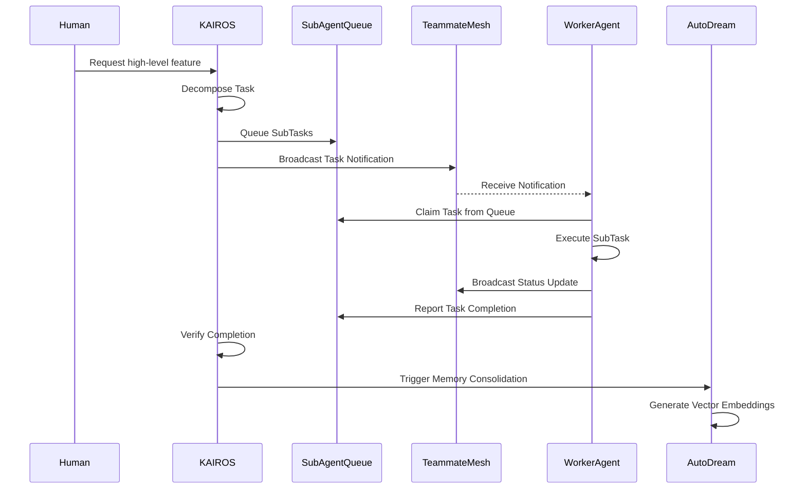

# KAIROS Orchestration: Master Architecture

## Executive Summary
KAIROS is the orchestration engine that powers the One Human Corp (OHC) Swarm. It enables a single human to orchestrate a vast swarm of AI agents with zero friction and maximum visual delight. KAIROS bridges the gap between Cloud-Native Kubernetes clusters and Standalone Desktop deployments through a unified, hybrid architecture.

## Phase 1: Shared Task List (Decomposition & UltraPlan)
- **Goal**: Decompose high-level feature requests into a Distributed Shared Task List to be consumed by the Sub-Agent Queue.
- **Database Schema**: PostgreSQL `shared_tasks_v4` and `sub_agent_queue` tables. Model directed acyclic graph (DAG) via shared tasks and dependencies.
- **State Machine Tracking**: Distributed state machine backed by Redis locks (Cloud) or DB locks (Standalone). Transitions are recorded in an audit log for full observability in `state_machine_transitions` table. Enforces deterministic transitions (e.g., `PENDING` -> `ASSIGNED` -> `IN_PROGRESS` -> `REVIEW` -> `COMPLETED` | `FAILED`).
- **Sub-Agent Queue**: Uses Redis Lists and Sorted Sets for delayed execution (Cloud-Native Mode). Uses an internal SQLite table `sub_agent_jobs` (Standalone Mode).

## Phase 2: Teammate Mesh APIs (Orchestration)
- **Goal**: Architect a highly available realtime communication layer for agent coordination.
- **Implementation**: Realtime Pub/Sub powered by Redis Pub/Sub using channels like `mesh:tasks`, `mesh:coordination`, and `mesh:ultraplan`.
- **Hybrid Support**: In-memory local bus for Standalone Mode.

## Phase 3: AutoDream Pipeline
- **Goal**: Architect data pipelines for OHC's long-term memory consolidation system.
- **Implementation**: Background jobs periodically summarize raw task logs and commit the resulting embeddings to the vector DB (pgvector or local SQLite equivalent). Utilizes PostgreSQL with the `pgvector` extension for exact Nearest Neighbor search on 1536-dimensional embeddings (Cloud-Native Mode). Embeddings are stored as JSON text blobs in SQLite (Standalone Mode). Stored in `autodream_memories` table.

## Swarm Coordination Flow

