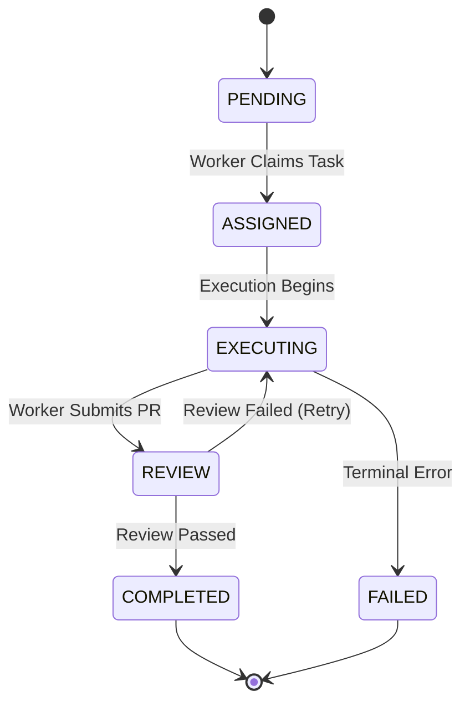
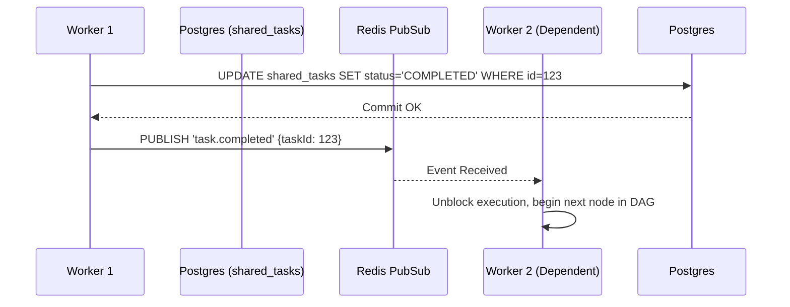

<div markdown="1" style="backdrop-filter: blur(20px) saturate(200%); font-family: 'Outfit', 'Inter', sans-serif; border: 1px solid rgba(255, 255, 255, 0.1); padding: 20px; border-radius: 12px; background: rgba(255, 255, 255, 0.03); color: #fff;">

# KAIROS Orchestration: Master Architectural Design

The KAIROS engine forms the structural and aesthetic core of the One Human Corp (OHC) "Hybrid Agentic OS." This document outlines the foundational pillars required to support autonomous task decomposition, multi-agent coordination, and long-term memory synthesis across both Cloud-Native and Standalone operating modes.

## 1. Architectural Pillars

KAIROS consists of three interlocking components:

1.  **Shared Task List:** The centralized queue and state tracking system.
2.  **Teammate Mesh:** The realtime event broadcasting and coordination layer.
3.  **AutoDream Pipeline:** The episodic memory consolidation and vector embedding engine.

---

## 2. Shared Task List (Phase 1)

The Shared Task List enables complex feature requests to be decomposed by Orchestrator agents and claimed by domain-specific workers securely, without contention.

### Database Design & Concurrency
We support robust locking strategies adapted to the deployment environment:

- **Cloud-Native Mode (PostgreSQL):** Utilizes row-level locking via `SELECT ... FOR UPDATE SKIP LOCKED` to ensure concurrent pods safely dequeue independent tasks without race conditions.
- **Standalone Mode (SQLite):** Since `FOR UPDATE` is not natively supported by SQLite, we gracefully degrade by stripping those clauses at the adapter level and applying application-memory semaphores (`sync.Mutex`) to prevent local race conditions.

### State Transitions
State machine transitions must be highly deterministic and logged for observability.



---

## 3. Realtime Teammate Mesh (Phase 2)

To avoid inefficient polling, the Swarm utilizes the Teammate Mesh to broadcast coordination events instantly.

### Architecture Topology
- **Cloud-Native:** Relies on Redis Pub/Sub (`rueidis`) to ensure horizontal distribution across the Kubernetes cluster.
- **Standalone:** Uses a local memory-backed `CentrifugeNode` to deliver the same API surface without external dependencies.



---

## 4. AutoDream Pipeline (Phase 3)

The AutoDream pipeline guarantees Swarm Intelligence Protocol (OHC-SIP) compliance by preventing context overflow through continuous long-term memory indexing.

### Vector Storage strategy
- **Cloud-Native:** Relies on `pgvector` extension for high-performance 1536-dimensional exact Nearest Neighbor searches across organizational boundaries.
- **Standalone:** Uses serialized JSON embeddings with client-side cosine similarity scoring, gracefully omitting `pgvector` dependencies.

```mermaid
graph TD
    A[Completed Tasks & Sessions] -->|Batch Sweep| B(AutoDream Worker)
    B -->|Chunking| C[LLM Embeddings API]
    C -->|Vector Data| D{Storage Backend}
    D -->|Postgres| E[(pgvector: autodream_memories)]
    D -->|SQLite| F[(JSON Blob Fallback)]

    classDef premium fill:rgba(255,255,255,0.03),stroke:rgba(255,255,255,0.08),stroke-width:1px,color:#fff,backdrop-filter:blur(20px) saturate(200%);
    class A,B,C,D,E,F premium;
```

</div>