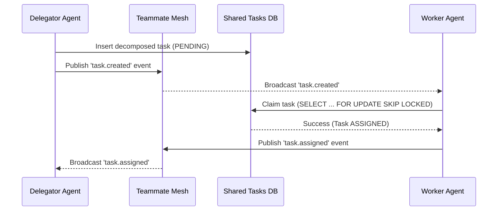

# Master Design Doc: KAIROS AI OS Orchestration

## Overview
The KAIROS engine defines the structural and aesthetic vision for the OHC "Hybrid Agentic OS." It provides the essential scaffolding required to coordinate a Swarm of autonomous agents capable of safely breaking down and executing complex feature requests.

## Phase 1: Shared Task List (Database Decomposition)
To decompose high-level features, agents need a central, durable state of work. The `shared_tasks` database acts as this unified queue.
- **Locking Mechanisms:** Uses PostgreSQL `FOR UPDATE SKIP LOCKED` (Cloud-Native) to assign tasks atomically, avoiding concurrent "split-brain" agent processing. In Standalone SQLite mode, degrades to `sync.Mutex` application-level locking.
- **Schema Key Elements:** Tracks `status`, `assigned_agent_id`, and `dependencies`.

## Phase 2: Realtime Teammate Mesh APIs
Agents require instantaneous coordination and mailbox functionality.
- **Messaging Layer:** `CentrifugeNode` handles the web socket/real-time pub/sub functionality.
- **Scalability:** Backed by `rueidis` Redis Pub/Sub in Cloud-Native mode to bridge communication across stateless Go pods.
- **State Integrity:** Uses a distributed state machine (Redis `SET NX EX` or Postgres transactions) to track agent states reliably.

## Phase 3: AutoDream Memory Consolidation
The AutoDream data pipeline acts as the Swarm's "Long-Term Memory."
- **Collection:** Sweeps ephemeral session data (`.agent-task/memory/`) generated during tasks.
- **Processing:** Chunks, tokenizes, and converts data into 1536-dimensional embeddings.
- **Storage:** Uses `pgvector` for scalable nearest-neighbor semantic search in Postgres. Defaults to JSON blobs and sequential scanning in SQLite for graceful degradation.

## Aesthetic Mandate
KAIROS orchestration dashboards will rigorously adhere to the visual identity of OHC:
- `backdrop-filter: blur(20px) saturate(200%)`
- `background: rgba(255, 255, 255, 0.03)`
- `font-family: 'Outfit', 'Inter', sans-serif`

