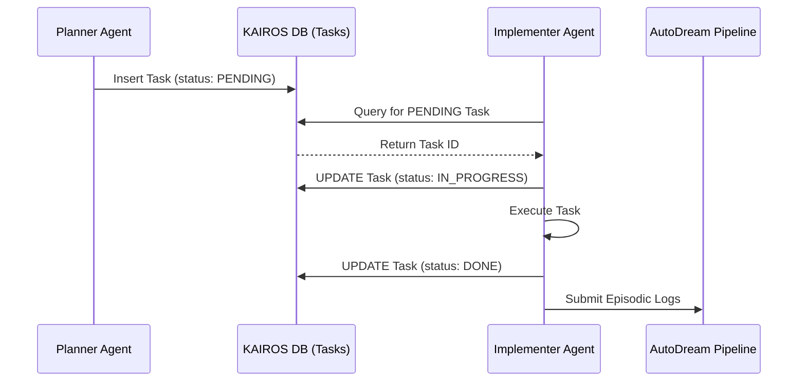

# OHC KAIROS Master Orchestration Design

## 1. Overview
The KAIROS Orchestrator acts as the central brain for the OHC Swarm. It decomposes complex user intents into manageable tasks, tracks their execution via a state machine, and synchronizes memory via the AutoDream pipeline.

## 2. Shared Task List Architecture
To support both Cloud-Native and Standalone Desktop modes, the Shared Task List relies on a hybrid DB schema.
- **Tasks Table**: `id`, `title`, `description`, `status`, `assigned_agent`, `created_at`, `updated_at`.
- **Hybrid Support**: Uses `datetime('now')` for SQLite and `NOW()` for PostgreSQL.

## 3. Realtime Teammate Mesh APIs
The Teammate Mesh facilitates inter-agent communication and task state broadcasting.
- **Channels**: Standardized channels such as `mesh:tasks` and `mesh:coordination`.
- **Implementation (Cloud)**: Backed by Redis Pub/Sub (e.g., using `rueidis`).
- **Implementation (Local)**: Backed by an in-memory event bus to degrade gracefully when Redis is absent.

## 4. AutoDream Data Pipeline
The AutoDream pipeline is responsible for long-term memory consolidation.
- **Vector Embeddings**: Vector embeddings generated from agent episodic memory are stored. In Go, these are mapped to `[]byte` natively (not `[]float32` JSON).
- **Consolidation Cycle**: Background jobs periodically summarize raw task logs and commit the resulting embeddings to the vector DB (pgvector or local SQLite equivalent).

## 5. Sub-Agent Orchestration & State Machine
- **State Tracking**: A distributed state machine tracks the lifecycle of complex architectural tasks to prevent deadlocks.
- **Coordination**: Uses distributed Redis locks in Cloud mode to coordinate concurrent access to shared resources.

## 6. Premium Visual Identity
All orchestration dashboards must adhere to the OHC Premium Aesthetic:
- Glassmorphism effects with a 20px background blur.
- Background tint: `rgba(255, 255, 255, 0.03)`.
- Typography: Outfit/Inter font families.

## 7. Sequence Diagrams

### Shared Task Assignment Flow

