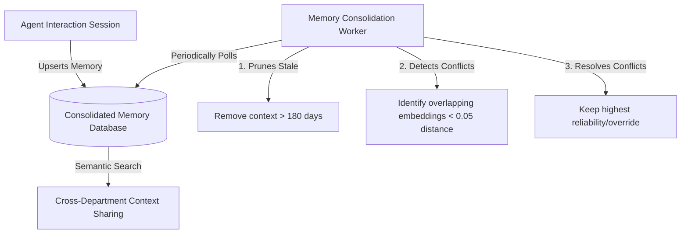

# Architecture: Long-Term Memory & Context Consolidation

## Overview

The Memory Consolidation System is responsible for giving OHC AI agents long-term persistent memory across sessions. When an AI processes customer interactions or business events, relevant context is embedded and stored.

## System Design

### Components

1.  **Persistent Memory Layer:**
    *   Works in both Cloud (PostgreSQL `pgvector`) and Standalone (SQLite with `vec_distance_cosine`) modes.
    *   Tenant-isolated access via RLS and strict application-level `tenant_id` bindings.
2.  **Conflict Resolution:**
    *   Detects duplicates using semantic distance (< 0.05).
    *   Resolves using hierarchy: `owner_override` > `reliability_score` > `created_at`.
3.  **Stale Context Pruning:**
    *   Removes contexts strictly where `last_referenced_at < 180 days ago`, `owner_override = FALSE`, `reference_count < 5`, and `source_type = 'TASK_SUMMARY'`.
    *   Conservative pruning: valuable business history is retained.
4.  **Cross-Department Context Sharing:**
    *   Allows any department within the *same tenant* to search the embedded history of other departments.
