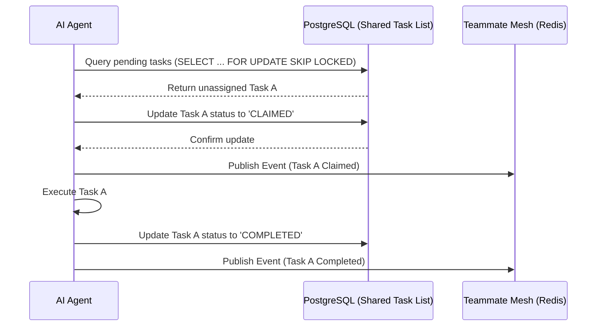

# KAIROS AI OS Architecture: Premium Hybrid Design

This document details the finalized Phase 4 architecture for the OHC KAIROS AI OS, incorporating the Shared Task List, Teammate Mesh, and AutoDream components into a robust, scalable system.

## Core Hybrid Orchestration Components

### 1. Shared Task List (Decomposition)
The Shared Task List handles the complex DAG structures of agentic tasks. It utilizes **PostgreSQL** (`SELECT FOR UPDATE`) to guarantee transaction safety across distributed agent nodes when claiming tasks. For offline or single-node edge environments, it provides **SQLite graceful degradation**, ensuring tasks can still be processed locally.

### 2. Teammate Mesh (Orchestration)
To enable real-time subagent communication, the Teammate Mesh employs **Redis Pub/Sub** via `redis` for high-throughput, low-latency cross-node messaging. For single-process scenarios, it falls back to a **local in-memory event bus**, achieving sub-millisecond IPC.

### 3. AutoDream Pipeline
The AutoDream pipeline handles the continuous self-reflection and experience distillation of our agent swarm. Using **`pgvector`** with `VECTOR(1536)` dimensions, it performs long-term memory consolidation of session logs, extracting semantic value for future task optimization.

---

## Task Claiming Flow

The following sequence demonstrates how an agent interacts with the Shared Task List to securely claim and execute a task in a concurrent environment.

---

## Execution Modes: Cloud-Native vs. Standalone

| Feature | Cloud-Native Mode | Standalone (Edge) Mode |
|---------|-------------------|-------------------------|
| **Task Storage** | PostgreSQL | SQLite |
| **Concurrency Control** | `SELECT FOR UPDATE SKIP LOCKED` | Local DB file locks |
| **IPC / Messaging** | Redis Pub/Sub (`redis`) | In-memory Event Bus |
| **Memory Storage** | Managed `pgvector` Database | Local Vector DB / SQLite VSS |
| **Target Environment** | Distributed Kubernetes Cluster | Mobile / Desktop App (Flutter) |
| **Latency Profile** | ~10-50ms network overhead | < 1ms local memory access |

