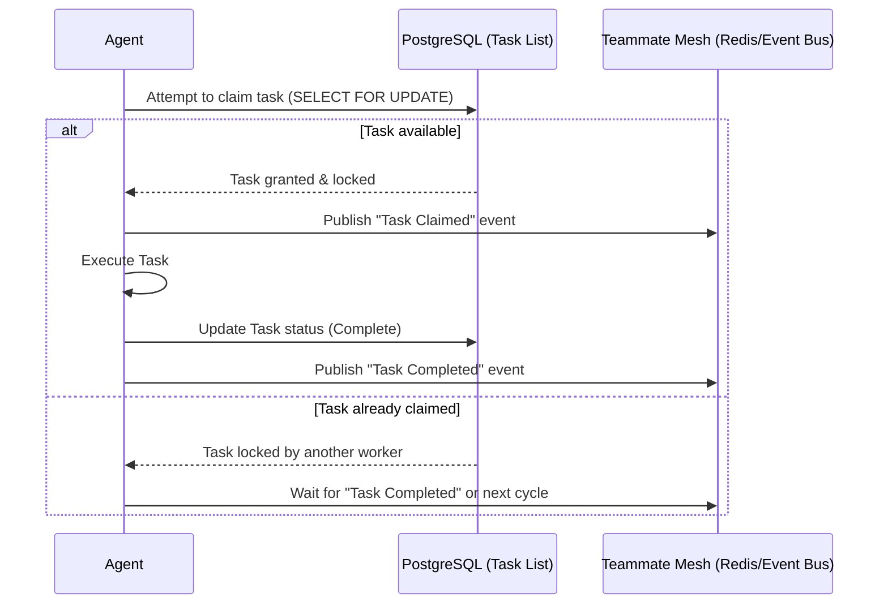

# KAIROS AI OS: Premium Hybrid Design Document

## 1. Introduction

This document finalizes the Phase 4 design of the OHC KAIROS AI OS architecture. KAIROS operates as a hybrid orchestration system designed to support both cloud-native deployments and standalone environments gracefully.

## 2. Core Orchestration Components

### 2.1 Shared Task List (Decomposition)
- **Primary Mechanism**: PostgreSQL utilizing `SELECT FOR UPDATE` pattern for distributed task locking. Supports robust DAG (Directed Acyclic Graph) representation for complex job decomposition.
- **Graceful Degradation**: Seamlessly falls back to SQLite for standalone, local, or single-node deployments without requiring code changes to the core scheduling logic.

### 2.2 Teammate Mesh (Orchestration)
- **Primary Mechanism**: Redis Pub/Sub powered by `rueidis` for high-throughput, low-latency inter-agent communication and mesh routing.
- **Graceful Degradation**: Utilizes local in-memory event buses for sub-millisecond IPC in environments without external Redis availability.

### 2.3 AutoDream Pipeline
- **Primary Mechanism**: Utilizing `pgvector` with `VECTOR(1536)` dimension embeddings for long-term memory consolidation of session logs and context retention across AI interactions.

## 3. Architecture Diagrams

### Task Claiming Flow

## 4. Deployment Modes

| Feature/Component | Cloud-Native Mode | Standalone Mode |
|-------------------|-------------------|-----------------|
| **Database**      | PostgreSQL        | SQLite          |
| **Task Locking**  | `SELECT FOR UPDATE`| Local DB Locks  |
| **IPC / Mesh**    | Redis (`rueidis`) | In-Memory Bus   |
| **Vector Search** | `pgvector`        | Local Vector DB |
| **Scalability**   | Horizontal        | Single-Node     |
| **Latency**       | Network RTT       | Sub-millisecond |

