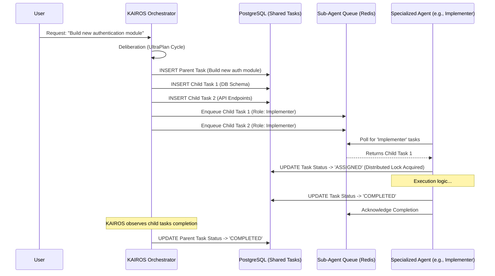

<div markdown="1" style="backdrop-filter: blur(20px) saturate(200%); font-family: 'Outfit', 'Inter', sans-serif; border: 1px solid rgba(255, 255, 255, 0.1); padding: 20px; border-radius: 12px; background: rgba(255, 255, 255, 0.05); color: #fff;">

# Shared Task List: Core Coordination Mechanism

The Shared Task List is the foundational database structure enabling the One Human Corp (OHC) Swarm to decompose complex features into a trackable, globally visible backlog. It serves as the single source of truth for the KAIROS Orchestrator to distribute tasks among specialized sub-agents.

## 1. Feature Overview

In multi-agent environments, tasks cannot be isolated to individual process memory. The Shared Task List ensures:

*   **Durability:** Tasks persist across agent restarts and pod evictions.
*   **Visibility:** All agents can query the current swarm objective and their specific assignments.
*   **Decomposition Tracking:** Parent-child relationships link high-level feature requests (e.g., "Implement OAuth") to granular sub-tasks (e.g., "Create `/api/auth` endpoint", "Write React login form").

## 2. Database Design (PostgreSQL Schema)

The core data model relies on a recursive relationship to represent task decomposition.

```sql
CREATE EXTENSION IF NOT EXISTS "uuid-ossp";

CREATE TABLE IF NOT EXISTS shared_tasks (
    id UUID PRIMARY KEY DEFAULT uuid_generate_v4(),
    organization_id TEXT NOT NULL,
    parent_task_id UUID REFERENCES shared_tasks(id) ON DELETE CASCADE,
    title TEXT NOT NULL,
    description TEXT,
    assigned_agent_role TEXT, -- e.g., 'Researcher', 'Implementer'
    assigned_agent_id TEXT,   -- Specific agent instance ID, if claimed
    status TEXT NOT NULL DEFAULT 'PENDING', -- PENDING, ASSIGNED, IN_PROGRESS, REVIEW, COMPLETED, FAILED
    priority TEXT NOT NULL DEFAULT 'P2',    -- P0, P1, P2, P3
    estimated_scope TEXT,                   -- Small, Medium, Large
    mission_file_path TEXT,                 -- Link to .agent-task/missions/ file
    created_at TIMESTAMPTZ DEFAULT CURRENT_TIMESTAMP,
    updated_at TIMESTAMPTZ DEFAULT CURRENT_TIMESTAMP
);

CREATE INDEX idx_shared_tasks_org ON shared_tasks(organization_id);
CREATE INDEX idx_shared_tasks_status ON shared_tasks(status);
CREATE INDEX idx_shared_tasks_parent ON shared_tasks(parent_task_id);

-- Enforce valid transitions via the Distributed State Machine Tracker
```

## 3. Execution Sequence

The following sequence illustrates how KAIROS decomposes a high-level goal and how sub-agents process the resulting task list.



## 4. Hybrid Compatibility

In **Standalone Mode** (`OHC_STANDALONE=true`), the PostgreSQL schema maps directly to SQLite. Recursive queries (`WITH RECURSIVE`) are supported natively by SQLite. Task claiming relies on the SQLite mutexed implementation of the Sub-Agent Orchestration Queue to prevent `SQLITE_BUSY` contention rather than Redis locks.

</div>
