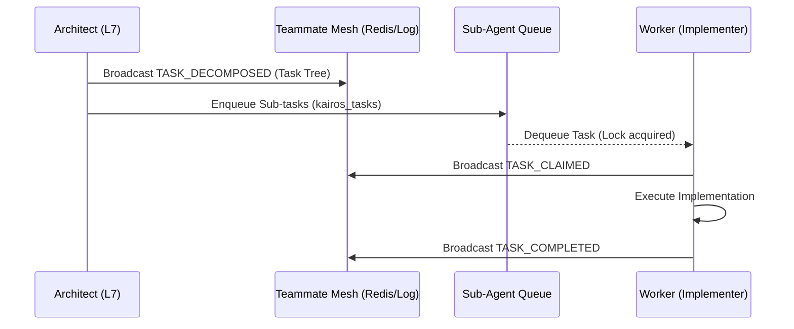

<div markdown="1" style="backdrop-filter: blur(20px) saturate(200%); font-family: 'Outfit', 'Inter', sans-serif; border: 1px solid rgba(255, 255, 255, 0.1); padding: 20px; border-radius: 12px; background: rgba(255, 255, 255, 0.05); color: #fff;">

# Shared Task List & Teammate Mesh Architecture

The Shared Task List, powered by the KAIROS Orchestrator, is the core of OHC's swarm intelligence logic, enabling multiple sub-agents to collaborate seamlessly in a distributed environment. This document outlines the database schemas, the architecture of the Realtime Teammate Mesh APIs, and the AutoDream vector pipeline integration for task execution and orchestration.

## 1. Problem Statement

Complex agentic workflows cannot be handled sequentially by a single monolithic model call. High-level requests (like "Build a new feature") must be decomposed into isolated, concurrent sub-tasks (e.g., UI design, Backend database schemas, tests). A distributed memory system with realtime communication is strictly required for seamless swarm execution.

## 2. KAIROS Shared Task List Schemas

The orchestration state is saved in the OHC SIP (Swarm Intelligence Protocol) databases.

```sql
CREATE EXTENSION IF NOT EXISTS "uuid-ossp";

CREATE TABLE IF NOT EXISTS kairos_tasks (
    id UUID PRIMARY KEY DEFAULT uuid_generate_v4(),
    organization_id TEXT NOT NULL,
    parent_task_id UUID REFERENCES kairos_tasks(id) ON DELETE CASCADE,
    title TEXT NOT NULL,
    description TEXT,
    priority TEXT CHECK(priority IN ('P0', 'P1', 'P2', 'P3')),
    status TEXT CHECK(status IN ('PENDING', 'ASSIGNED', 'IN_PROGRESS', 'REVIEW', 'COMPLETED', 'FAILED')) DEFAULT 'PENDING',
    assigned_agent_role TEXT,
    assigned_agent_id TEXT,
    created_at TIMESTAMPTZ DEFAULT CURRENT_TIMESTAMP,
    updated_at TIMESTAMPTZ DEFAULT CURRENT_TIMESTAMP
);

CREATE INDEX idx_kairos_tasks_org ON kairos_tasks(organization_id);
CREATE INDEX idx_kairos_tasks_status ON kairos_tasks(status);
```

## 3. Realtime Teammate Mesh APIs

The Teammate Mesh provides low-latency coordination across agents executing in K8s pods or in a standalone environment.

### Pub/Sub Coordination Layer

- **Cloud Mode:** Leverages Redis Pub/Sub channels (e.g., `mesh:org_{id}:events`).
- **Standalone Mode:** Relies on local memory streams and file-based mock logs (`.agent-task/memory/mesh_mock.log`) to simulate coordination without complex dependencies.

### Key Events

- `TASK_DECOMPOSED`: An architect agent completes ultraplan deliberation and publishes the task graph.
- `TASK_CLAIMED`: A worker agent locks a sub-task via the State Machine and broadcasts its intent.
- `TASK_COMPLETED`: A worker agent broadcasts success, triggering the AutoDream pipeline to ingest artifacts.



## 4. AutoDream pgvector / LLM Embeddings Pipeline

After successful task execution, the `AutoDreamWorker` sweeps context data from the workspace and injects the synthesized truth into the `autodream_memories` vector table.

When sub-agents begin subsequent tasks, the Omni-Context Sub-agent Routing immediately retrieves relevant previous tasks using pgvector similarity search:

```sql
SELECT content
FROM autodream_memories
WHERE organization_id = $1
ORDER BY embedding <-> $2
LIMIT 5;
```

This ensures zero-latency grounding and prevents alignment drift across isolated sub-agents.

</div>
