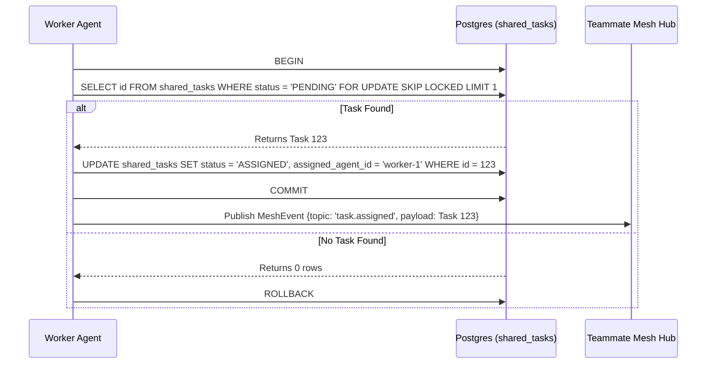

<div markdown="1" style="backdrop-filter: blur(20px) saturate(200%); font-family: 'Outfit', 'Inter', sans-serif; border: 1px solid rgba(255, 255, 255, 0.1); padding: 20px; border-radius: 12px; background: rgba(255, 255, 255, 0.05); color: #fff;">

# Shared Task List

The Shared Task List serves as the "Brain" of the KAIROS Orchestration engine, providing a durable, distributed state machine where agents can enqueue, claim, and transition the status of decomposed tasks.

## 1. Database Schema

The `shared_tasks` table ensures persistent task tracking across both Cloud-Native and Standalone deployments.

```sql
CREATE TABLE IF NOT EXISTS shared_tasks (
    id TEXT PRIMARY KEY,
    organization_id TEXT NOT NULL,
    parent_plan_id TEXT,
    title TEXT NOT NULL,
    description TEXT,
    status TEXT NOT NULL DEFAULT 'PENDING',
    assigned_agent_id TEXT,
    dependencies JSONB,
    created_at TIMESTAMPTZ DEFAULT CURRENT_TIMESTAMP,
    updated_at TIMESTAMPTZ DEFAULT CURRENT_TIMESTAMP
);
CREATE INDEX IF NOT EXISTS idx_shared_tasks_org_status ON shared_tasks(organization_id, status);
```

## 2. Distributed Locking Mechanisms

To prevent concurrent assignment conflicts (worker collisions) when claiming tasks:
- **Cloud-Native Mode (PostgreSQL):** Uses `SELECT ... FOR UPDATE SKIP LOCKED`.
- **Standalone Mode (SQLite):** Uses application-level mutexes or transaction isolation.

## 3. Sequence Diagram: Task Claiming



</div>
