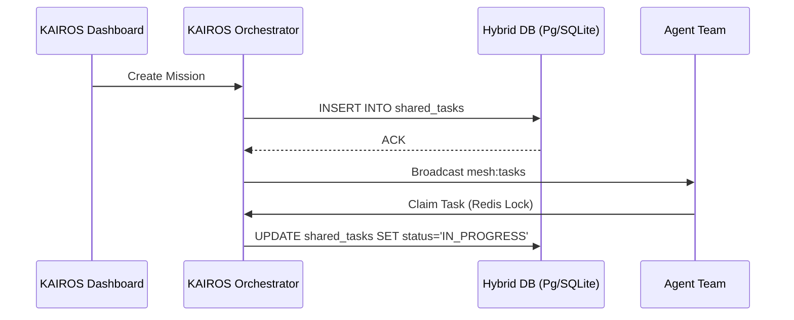

# KAIROS Orchestrator: Shared Task List Database Schema

## Overview
This document outlines the database schema required for the OHC Swarm to manage deep-deliberation cycles and distributed tasks.

## Sequence Diagram: Deep Deliberation Cycle


## Cloud-Native Mode (PostgreSQL)
```sql
CREATE TABLE IF NOT EXISTS shared_tasks (
    id VARCHAR PRIMARY KEY,
    organization_id VARCHAR NOT NULL,
    title VARCHAR NOT NULL,
    status VARCHAR NOT NULL DEFAULT 'PENDING',
    dependencies JSONB NOT NULL DEFAULT '[]',
    created_at TIMESTAMP WITH TIME ZONE DEFAULT CURRENT_TIMESTAMP
);
```

## Standalone Mode (SQLite Graceful Degradation)
```sql
CREATE TABLE IF NOT EXISTS shared_tasks (
    id TEXT PRIMARY KEY,
    organization_id TEXT NOT NULL,
    title TEXT NOT NULL,
    status TEXT NOT NULL DEFAULT 'PENDING',
    dependencies TEXT NOT NULL DEFAULT '[]',
    created_at DATETIME DEFAULT CURRENT_TIMESTAMP
);
```
