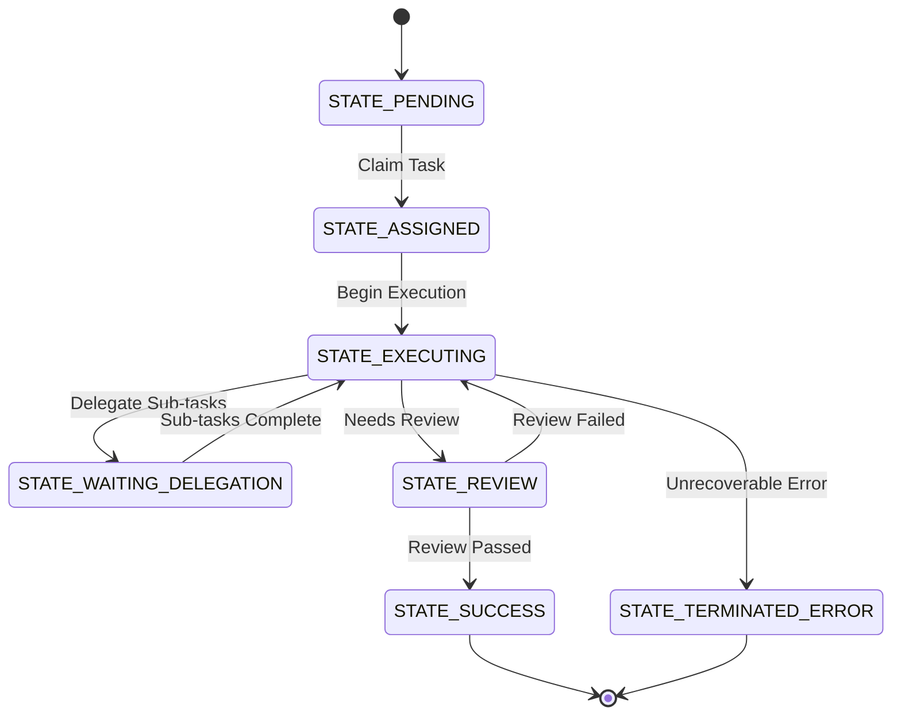

<div markdown="1" style="backdrop-filter: blur(20px) saturate(200%); font-family: 'Outfit', 'Inter', sans-serif; border: 1px solid rgba(255, 255, 255, 0.1); padding: 20px; border-radius: 12px; background: rgba(255, 255, 255, 0.05); color: #fff;">

# Distributed State Machine Tracker

The Distributed State Machine Tracker is a core pillar of the KAIROS Orchestration engine within the One Human Corp (OHC) architecture. It provides a robust, resilient mechanism to track and transition agent coordination states reliably, especially in complex multi-agent workflows.

## 1. Core Architecture

The OHC swarm relies on the Teammate Mesh for coordination. However, without a distributed state machine, task dependencies are brittle: if an agent crashes mid-task, the DAG (Directed Acyclic Graph) of dependencies can stall permanently.

This state machine enforces deterministic transitions (e.g., `PENDING` -> `ASSIGNED` -> `IN_PROGRESS` -> `REVIEW` -> `COMPLETED` | `FAILED`).

### Transition Flow



## 2. Distributed Locking Mechanism

To ensure transitions survive worker pod failures and prevent race conditions, the state machine utilizes distributed locks:

- **Cloud Mode:** Uses Redis (`rueidis`) `SET NX EX` to acquire an exclusive lock on the entity ID before reading current state and transitioning.
- **Standalone Mode:** Uses SQLite/PostgreSQL transaction (`FOR UPDATE` if Postgres) or SQLite database lock to serialize transitions.

## 3. Database Schema Integration

Transitions are recorded in an audit log for full observability.

```sql
CREATE TABLE IF NOT EXISTS state_machine_transitions (
    id TEXT PRIMARY KEY,
    entity_id TEXT NOT NULL,
    entity_type TEXT NOT NULL,
    from_state TEXT NOT NULL,
    to_state TEXT NOT NULL,
    agent_id TEXT,
    reason TEXT,
    occurred_at TIMESTAMPTZ DEFAULT CURRENT_TIMESTAMP
);
CREATE INDEX idx_sm_entity ON state_machine_transitions(entity_id, entity_type);
```

## 4. Teammate Mesh Integration

Upon every successful state change, the state machine emits an event to the Pub/Sub Teammate Mesh via the `CentrifugeNode` hub. This allows other agents to react to state changes in real-time.

</div>
