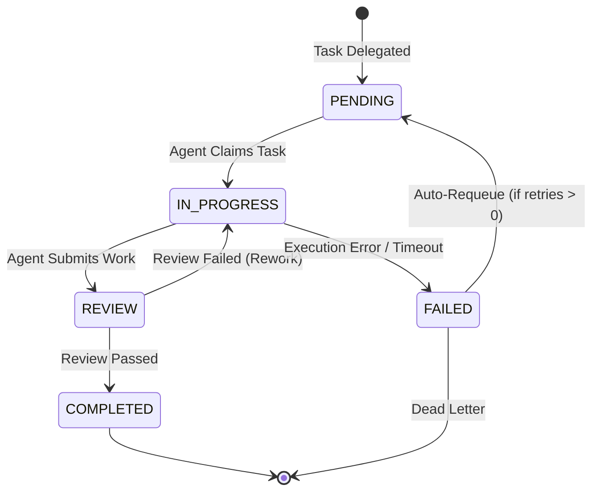
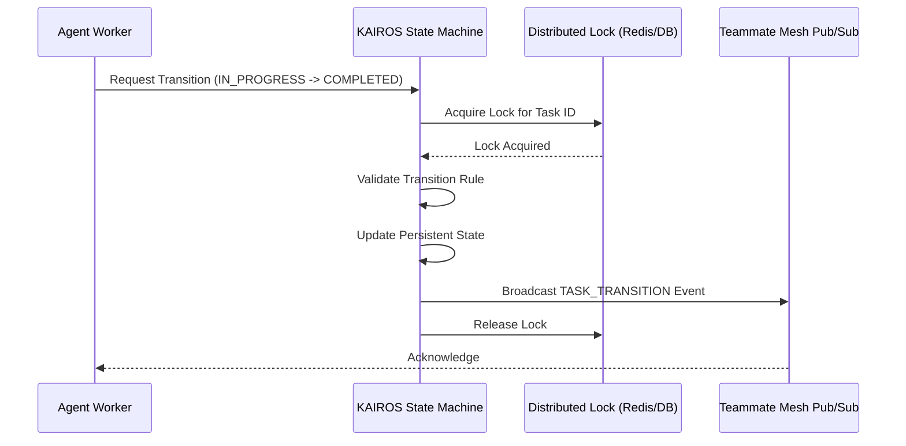

# KAIROS Distributed State Machine

**Component:** Orchestration Layer | **Target Audience:** Orchestration Engineers & Architects

## 1. Overview
The **KAIROS Distributed State Machine** provides strict, resilient state transition tracking for multi-agent workflows across the Teammate Mesh. It resolves the problem of brittle dependencies in complex Directed Acyclic Graph (DAG) task structures where agent failure could lead to permanently stalled workflows.

By externalizing the coordination state (using Redis distributed locks in Cloud-Native mode or database row locks in Standalone mode), the State Machine ensures tasks transition deterministically and survive worker pod failures.

## 2. State Transition Flow

The State Machine enforces allowed transitions. A typical task will progress through the following lifecycle:

## 3. High Availability and Pub/Sub
Every time a state transitions, the State Machine orchestrator emits a validated event to the `Teammate Mesh` (via Centrifuge Realtime Pub/Sub). This immediately updates any connected human dashboards or listening agents.

### Example Sequence

## 4. Resilience and Failover
- **Timeout Monitoring:** The State Machine continuously monitors tasks in `IN_PROGRESS` or `REVIEW`. If a timeout is exceeded without an active heartbeat, the state is transitioned to `FAILED` or re-queued to `PENDING`.
- **Idempotency:** Transition requests are idempotent to prevent double-processing during network partitions.
- **Standalone Degradation:** If Redis is unavailable (Standalone mode), the State Machine seamlessly falls back to SQLite transaction locks with specific retry backoffs to handle `ohc_sqlite_lock_contention_total`.

