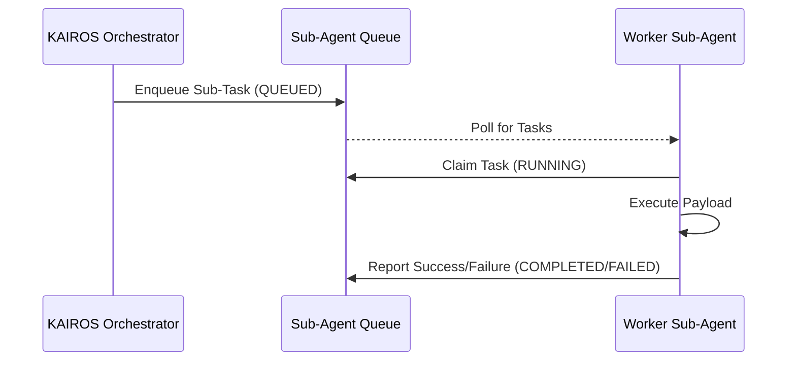

# KAIROS Sub-Agent Queue

The KAIROS Sub-Agent Queue enables the system to spawn, manage, and monitor isolated sub-agents executing background tasks.

## Queue Orchestration Flow

## Details
- Integrates seamlessly with cloud-native Redis and standalone database modes.
- Ensures robust task isolation and tracking.

## References
- [KAIROS Master API Guide](../../technical/api/kairos-master-api-guide.md)
- [Sub-Agent Queue Design](../../technical/architecture/kairos/sub-agent-queue-design.md)

