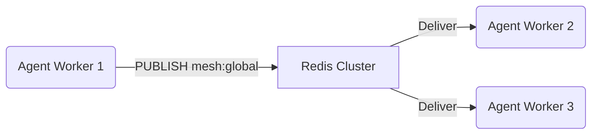
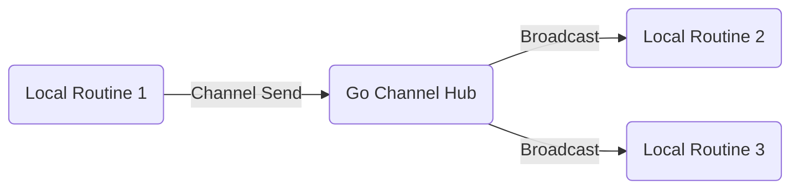

<div markdown="1" style="backdrop-filter: blur(20px) saturate(200%); font-family: 'Outfit', 'Inter', sans-serif; border: 1px solid rgba(255, 255, 255, 0.1); padding: 20px; border-radius: 12px; background: rgba(255, 255, 255, 0.05); color: #fff;">

# Teammate Mesh APIs

The Teammate Mesh is the ultra-low latency, real-time communication backbone for the One Human Corp (OHC) Swarm. It allows agents to broadcast state changes, share immediate context, and synchronize activities dynamically.

## 1. Core Architecture

The Mesh operates on a Pub/Sub model decoupled from the durable Task Queue. It is designed for ephemeral, high-throughput signaling rather than guaranteed task execution.

### Components

- **Hubs (Topics):** Logical channels (e.g., `mesh:global`, `mesh:org:{id}:events`, `mesh:task:{id}`).
- **Producers:** Agents broadcasting events (e.g., state transitions, heartbeat, discovery).
- **Consumers:** Agents subscribed to relevant Hubs listening for triggers.

## 2. API Contract

The Teammate Mesh is exposed to agents via the `CentrifugeNode` abstraction layer, normalizing the API regardless of the underlying hybrid provider.

### Go Interface (`srcs/server/agents/mesh/interface.go`)

```go
package mesh

import "context"

// TeammateMesh defines the real-time pub/sub API for swarm coordination.
type TeammateMesh interface {
    // Publish broadcasts a raw payload to the specified topic.
    Publish(ctx context.Context, topic string, payload []byte) error

    // Subscribe registers a handler for incoming messages on a topic.
    Subscribe(ctx context.Context, topic string, handler func(msg []byte)) error

    // Unsubscribe removes the subscription for the current agent context.
    Unsubscribe(ctx context.Context, topic string) error
}
```

### Event Payload Structure (JSON)

All events transmitted over the Mesh must adhere to a standardized schema:

```json
{
  "event_id": "evt_abc123",
  "timestamp": "2026-04-01T22:00:00Z",
  "type": "agent.state.changed",
  "source_agent_id": "agt_456xyz",
  "topic": "mesh:global",
  "payload": {
    "task_id": "tsk_789def",
    "previous_state": "IN_PROGRESS",
    "new_state": "COMPLETED"
  }
}
```

## 3. Hybrid Implementation

The system seamlessly swaps the underlying implementation based on the deployment mode.

### Cloud-Native Mode (Redis Pub/Sub)

In standard production environments, the Mesh is powered by Redis Pub/Sub.



### Standalone Mode (In-Memory Broadcast)

When `OHC_STANDALONE=true`, external dependencies like Redis are avoided. The Mesh falls back to an internal Go-native channel multiplexer (e.g., leveraging `sync.Cond` or localized WebSockets).



</div>
