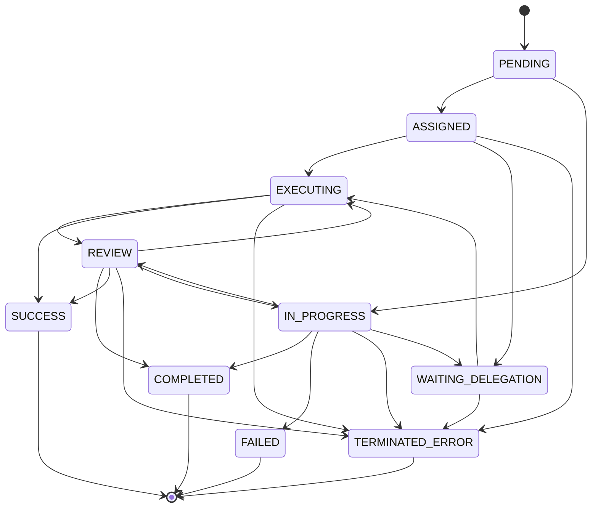
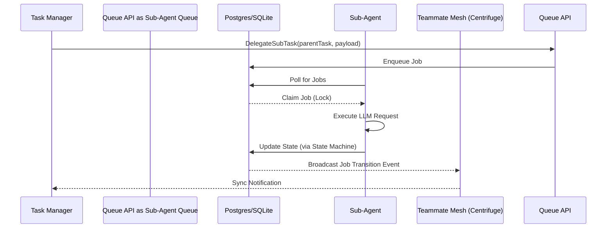

# KAIROS Orchestration: State Machine & Sub-Agent Queue Deep Dive

The One Human Corp (OHC) AI OS introduces a highly resilient, distributed workflow engine known as the **KAIROS Orchestrator**. To prevent multi-agent task stagnation and guarantee fault-tolerant execution, two major components have been introduced: the **Distributed State Machine** and the **Sub-Agent Job Queue**.

---

## 1. The Distributed State Machine Tracker

Complex multi-agent workflows—such as an Architect delegating to a Coder, who then delegates to a Tester—rely heavily on robust dependency graphs. Without strict state transitions, the Directed Acyclic Graph (DAG) can stall permanently if an agent pod crashes mid-execution.

The **Distributed State Machine Tracker** externalizes the task execution states to prevent "stuck" states, enforce determinism, and emit synchronous broadcasts across the Teammate Mesh.

### 1.1 Supported State Transitions

The state machine implements a strict transition matrix:

### 1.2 Locking and Execution (Hybrid Architecture)

*   **Cloud-Native Mode (PostgreSQL / Redis):** Employs explicit `FOR UPDATE` transaction row locks during the state transition query to ensure no overlapping writes occur, combined with highly concurrent distributed caching mechanisms.
*   **Standalone Mode (SQLite):** Degrades gracefully utilizing SQLite database locks, preventing concurrent modification panics and maintaining serial execution safety.

Every transition writes an audit entry to the `state_machine_transitions` table, capturing `from_state`, `to_state`, `reason`, and `agent_id`.

---

## 2. Sub-Agent Queue

For ephemeral tasks that don't belong on the master DAG, the Orchestrator offloads execution to the **Sub-Agent Queue**.

### 2.1 Enqueueing Subtasks

When a primary agent delegates a sub-task via `TaskManager.DelegateSubTask`, the request is transformed into a `queue.Job` payload, ensuring the correct Sub-Agent role is addressed with its required prompt and instructions.

### 2.2 Queuing Backends
*   **Cloud-Native Mode:** Backed by **Rueidis** and Redis ZSETs (Sorted Sets) for distributed priority polling, preventing latency spikes.
*   **Standalone Mode:** Maps to the local SQLite database (`sub_agent_jobs` or `sub_agent_queue` table), where the Go backend's sync workers handle dispatch logic using mutexes to bypass lock contention.

### 2.3 System Flow

## 3. Observability & Telemetry

Every State Machine transition and Queue Enqueue/Dequeue action is metered via **OpenTelemetry**.
- `RecordSwarmTaskProcessingLatency`
- `RecordSwarmTaskTransition`
- `RecordSwarmTaskQueueLength`

In Standalone mode, these metrics flow into the local SQLite `telemetry_buffer` before synchronizing to the central Hub.

