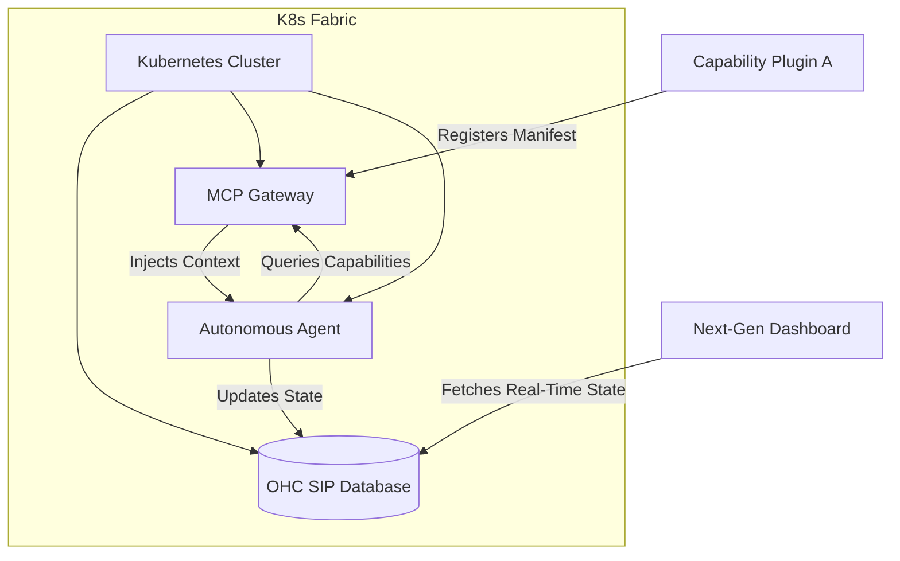

# Design Doc: Capability Plugin Mesh & Next-Generation Aesthetic OS
**Author(s):** Principal Product Architect & Visionary (L7)
**Status:** Approved
**Date:** 2026-03-30

## 1. Overview
The OHC Agentic OS requires absolute autonomy and a premium user experience. The current bottleneck—static "Skill Blueprints"—limits runtime adaptability. This design document specifies the transition to a dynamic "Capability Plugin Mesh" and the adoption of the "Premium Feel" design system.

## 2. Capability Plugin Mesh
Instead of hardcoded blueprints, agents will dynamically discover and adopt capabilities via the MCP (Model Context Protocol) Gateway.

### 2.1 Schema Definition (OHC-SIP)
New memory types will be introduced to the `swarm_memory` table:
- `capability_manifest`: Represents an available capability.
- `plugin_state`: Tracks active plugins for an agent.

### 2.2 System Architecture

## 3. Next-Generation Aesthetic Design System
The frontend UI will transition to a "Glassmorphism" design system, representing the fluidity and sophisticated nature of the Agentic OS.

### 3.1 Design Tokens (CSS)
All interfaces must adhere strictly to these tokens:
- **Backdrop**: `backdrop-filter: blur(15px) saturate(180%)`
- **Surface**: `background: rgba(255, 255, 255, 0.05)`
- **Border**: `border: 1px solid rgba(255, 255, 255, 0.1)`
- **Typography**: `font-family: 'Outfit', 'Inter', sans-serif`

### 3.2 Verification
Verification is strictly mandated via the Playwright `browser` tool. Visual stability and adherence to the Glassmorphism tokens must be verified.
