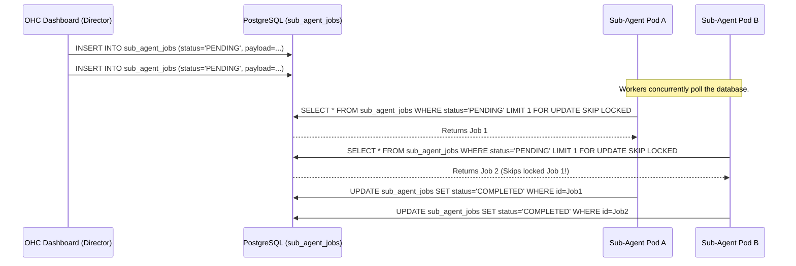

<div markdown="1" style="backdrop-filter: blur(20px) saturate(200%); font-family: Outfit, Inter, sans-serif; border: 1px solid rgba(255, 255, 255, 0.1); padding: 20px; border-radius: 12px; background: rgba(255, 255, 255, 0.05);">

# Guide: Sub-Agent Queue and Background Jobs

Welcome to the **Interactive Sub-Agent Queue Guide**. This document provides a visual and practical walkthrough of how OHC's KAIROS Orchestration layer manages distributed, high-concurrency background tasks without locking conflicts.

## 1. What is the Sub-Agent Queue?

When the human CEO or a Director Agent delegates a massive parallel task (like embedding 10,000 documents or sending 5,000 emails), these tasks cannot block the main orchestrator. They are pushed to the **Sub-Agent Queue**.

To support our **Cloud-Native Mode**, this queue avoids traditional file-based locks. Instead, it leverages PostgreSQL's `FOR UPDATE SKIP LOCKED` mechanism. This allows hundreds of independent worker pods to concurrently pull jobs from the same table without stepping on each other's toes.

## 2. Visualizing the Architecture

Here is how a job flows from creation to execution across the cluster:



## 3. Practical Usage: Submitting a Job

You can interact with the queue programmatically via the OHC API. For detailed schema information, please refer to the [API Playbook](../api_playbook.md).

Here is a quick `cURL` example of submitting a background embedding job:

```bash
curl -X POST https://api.ohc.network/api/queue/subagent \
  -H "Authorization: Bearer <YOUR_TOKEN>" \
  -H "Content-Type: application/json" \
  -d '{
    "job_type": "vector_embedding",
    "retries": 3,
    "payload": {
      "document_id": "doc-5678",
      "model": "text-embedding-004"
    }
  }'
```

## 4. Why `SKIP LOCKED`?

In standard `SELECT FOR UPDATE` queries, if Worker A locks Row 1, Worker B has to wait until Worker A finishes before it can even look at the table to find Row 2. This creates a massive bottleneck.

By appending `SKIP LOCKED`, PostgreSQL instantly bypasses any rows currently held by another transaction. This ensures that every worker immediately gets a fresh, unassigned job, enabling true horizontal scalability in the KAIROS engine.

</div>
