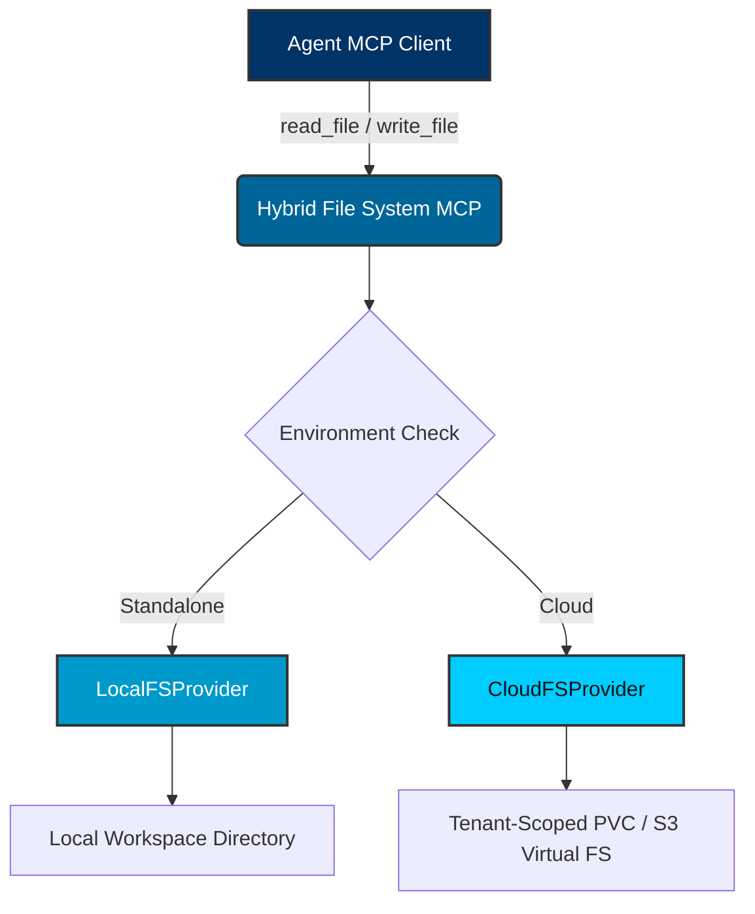

# Hybrid File System MCP Proxy

**Persona:** Agent Swarm | **Context:** Abstracting File System I/O
**Success Metrics:** Providing agents with seamless read/write/list operations that map to local directories in Standalone mode, and to tenant-isolated cloud volumes in Cloud-Native mode.

## 1. Unified Interface

The `mcp.FileSystemProvider` interface allows agents to perform standard file system operations without knowing if they are operating locally or in a massive multi-tenant cluster.

## 2. Supported Tools

The Hybrid FS MCP exposes the following capabilities:

- `read_file`: Read contents of a file at a specific path.
- `write_file`: Create or overwrite a file.
- `list_directory`: Recursively list files and directories.

## 3. Security Boundaries

In the OHC-HA architecture, strict access bounds are enforced.

- **Standalone Mode (`LocalFSProvider`)**: Utilizes aggressive input sanitization to prevent directory traversal. `filepath.Clean` and `strings.TrimPrefix` confine all I/O strictly to the `.agent-task` workspace.
- **Cloud Mode (`CloudFSProvider`)**: Operations are gated by `auth.Claims`. The proxy inspects the SPIFFE/SVID token to extract the `OrganizationID`, which is then used as the root jail path. Cross-tenant leakage is strictly prevented at the provider layer.

